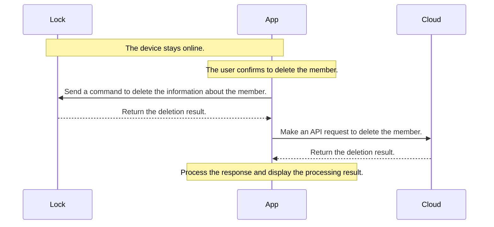
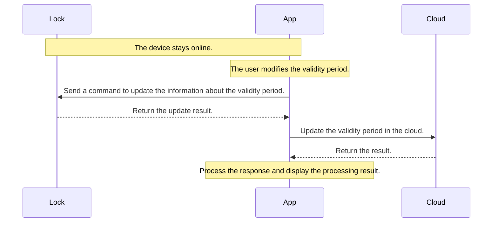
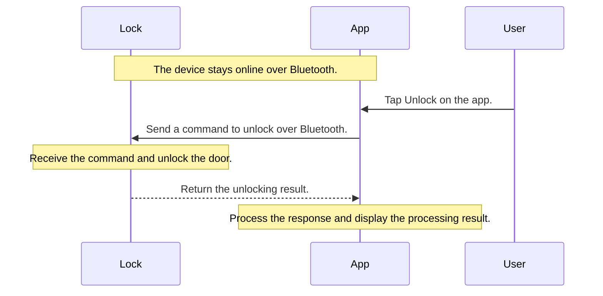
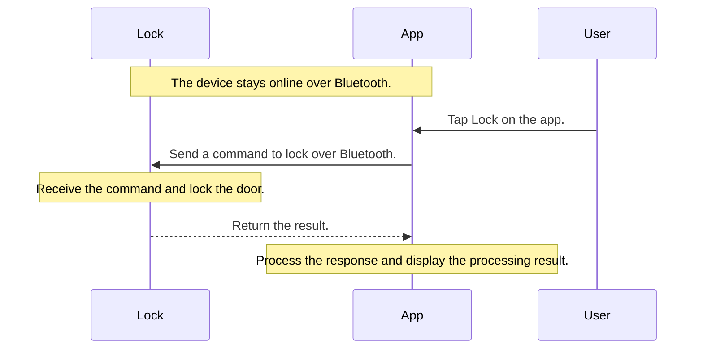
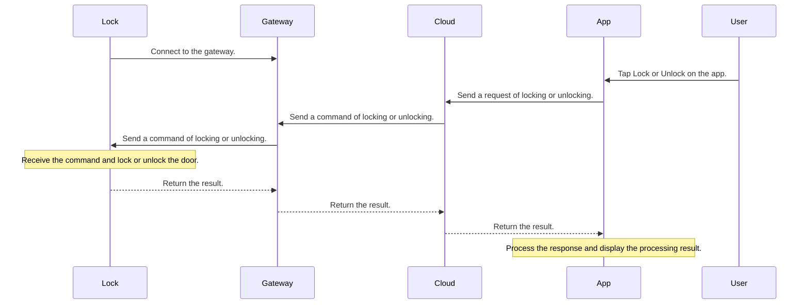
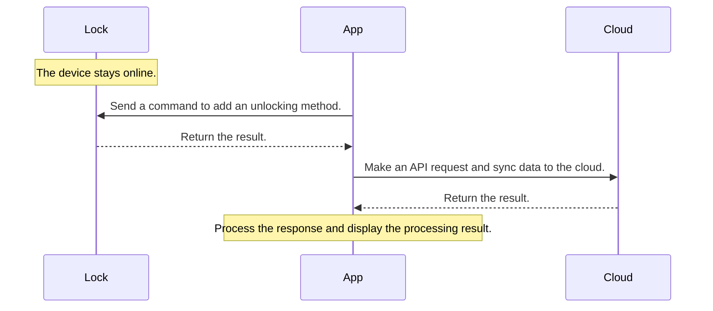
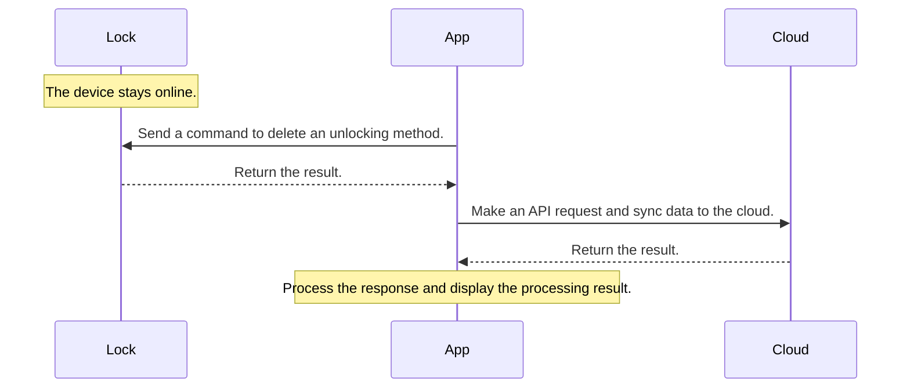
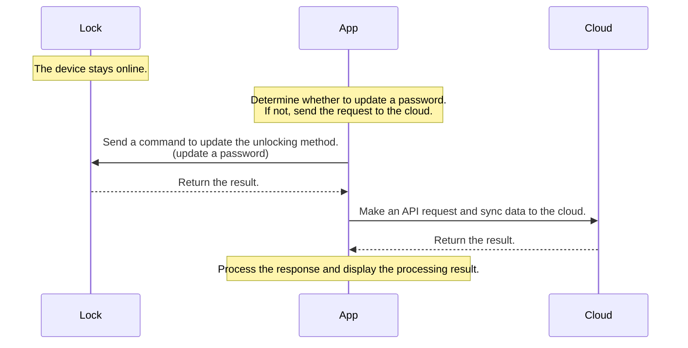
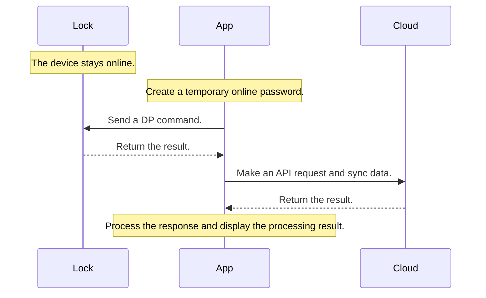
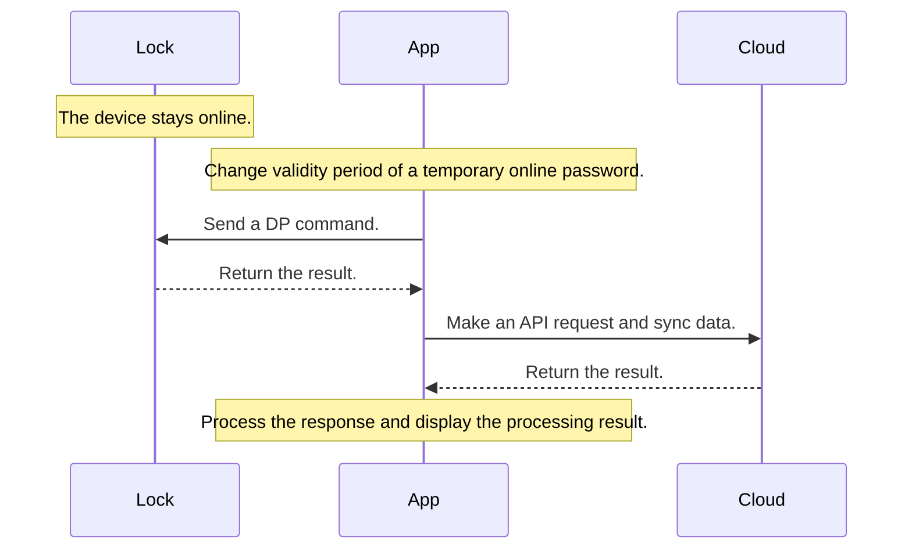

# Bluetooth Smart Lock

[中文版](README_zh.md) | [English](README.md)

## Functional description

| Class name | Description |
| ---- | ---- |
| `ThingOptimusSdk` | Provides access to the Smart Lock SDK initialization feature and returns the lock management class. |
| `IThingLockManager` | The lock management class that is used to get different types of lock classes. |
| `IThingBleLockV2` | The Bluetooth lock class that includes all methods of Bluetooth locks. |

**Example**

The following code block shows how to create a Bluetooth lock class based on a device ID.

```java
// Initialize the SDK for only once.
ThingOptimusSdk.init(getApplicationContext());
// Get the `IThingLockManager` class.
IThingLockManager thingLockManager = ThingOptimusSdk.getManager(IThingLockManager.class);
// Create the `IThingBleLockV2` class.
IThingBleLockV2 thingLockDevice = thingLockManager.getBleLockV2(your_device_id);
```

## Glossary

| Term | Description |
| --- | --- |
| Duress alarms | The duress alert feature allows users to enroll a password or fingerprint as a duress code. If they are coerced by hostile persons, unlocking with the duress code can trigger alerts to be sent to a list of contacts. The duress alarm feature allows users to enroll a password or fingerprint as a duress code. If they are coerced by hostile persons, unlocking with the duress code can trigger alerts to be sent to a list of contacts. |
| Lock members | Lock members are **home members**, the same as that defined in the Smart Life App SDK. The Smart Lock SDK can be used to bind a lock password ID with a home member account. For more information, see [Home Management](https://developer.tuya.com/en/docs/app-development/homemanage?id=Ka6kjkgere4ae). |
| lockUserId | A **lockUserId** is a member ID that the cloud assigns to a lock when you create a lock member. Each `lockUserId` indicates the member ID that is recorded in the firmware. |
| userId | A **userId** is the ID that the cloud assigns to a lock member when you create the member. Each `userId` is a unique ID of each user and is recorded in a database. |
| dpCode | An identifier of a data point (DP) for a device. Each DP is assigned a name and an identifier indicated by `dpCode`. For more information, see [List of Lock DPs](#dp). |
| unlockId | An `unlockId` is the unlocking method ID that consists of an unlocking DP ID plus a lock ID. Example: `12-02`. |

:::important
After the Smart Lock SDK is integrated, you must execute the unlocking methods mentioned in [Sync data](#data_synchronization) before the SDK can be used.
:::

## Lock members

This section describes the operations regarding **home members**.

<a id="lock_member_list"></a>

### Get a list of lock members

**API description**

```java
/**
* Get a list of home members
*
* @param callback The callback.
*/
void getProLockMemberList(IThingResultCallback<ArrayList<MemberInfoBean>> callback);
```

Data model of **`MemberInfoBean`**

| Field | Type | Description |
| --- | --- | --- |
| userId | String | The user ID. |
| avatarUrl | String | The avatar URL of the user. |
| lockUserId | Integer | The user ID that is associated with the lock. |
| nickName | String | The nickname. |
| userType | Integer | The type of user. Valid values:<ul><li>`10`: administrator.</li><li>`20`: common user.</li><li>`50`: home owner.</li></ul> |
| backHomeNotifyAttr | Integer | Indicates whether to enable notifications of **home member arrival**. Valid values:<ul><li>`0`: no.</li><li>`1`: yes.</li></ul> |
| userContact | String | The contact information of the member. |
| offlineUnlock | Boolean | Indicates whether to support offline unlocking. Valid values:<ul><li>`true`: yes</li><li>`false`: no</li></ul> |
| unlockDetail | List | The list of unlocking methods that the user can use. For more information, see `Data model of UnlockDetail`. |
| timeScheduleInfo | TimeScheduleInfo | The validity period of the user. |

Data model of **`TimeScheduleInfo`**

| Field | Type | Description |
| --- | --- | --- |
| permanent | Boolean | Indicates whether the user is a permanent user. |
| timeSetShifted | Boolean | Indicates whether the validity period of the non-permanent administrator has an offset. |
| userTimeSet | String | The hexadecimal validity period of the user. |
| effectiveTime | Integer | The 10-digit time when the validity period starts. |
| expiredTime | Integer | The 10-digit time when the validity period ends. |
| scheduleDetails | List | Indicates whether the validity period recurs weekly and the recurring interval. For more information, see [`Data model of ScheduleBean`](#mode_schedule_bean). |

<a id="mode_schedule_bean"></a>

Data model of **`ScheduleBean`**

| Field | Type | Description |
| --- | --- | --- |
| workingDay | Integer | The working days. For more information, see [Things to note](#wording_day_illustrate). |
| allDay | Boolean | Indicates whether the setting is valid all the day. |
| effectiveTime | Integer | The start time in minutes. <br>Example: To make the setting take effect at 8 o'clock in the morning on the current day, the value is 480= 8 × 60. |
| invalidTime | Integer | The end time in minutes. <br>Example: To make the setting expire at 20 o'clock in the afternoon on the current day, the value is 1200= 20 × 60. |
| timeZoneId | String | The time zone information. |

Data model of **`UnlockDetail`**

| Field | Type | Description |
| --- | --- | --- |
| dpId | Integer | The DP ID of the feature. |
| count | Integer | The number of unlocking methods. |
| unlockList | List | The list of unlocking methods. For more information, see [`Data model of UnlockInfoBean`](#UnlockInfoBean). |

<a id="UnlockInfoBean"></a>

Data model of **`UnlockInfoBean`**

| Field | Type | Description |
| --- | --- | --- |
| unlockId | String | The ID of an unlocking method. |
| opModeId | Long | The ID of an unlocking method in the cloud. |
| unlockName | String | The name of an unlocking method. |
| unlockAttr | Integer | The attribute of an unlocking method. Valid values:<ul><li>`1`: with duress alarm</li><li>`0`: no duress alarm</li></ul> |
| adminFlag | Boolean | Indicates whether the administrator's fingerprint is used. |
| photoUnlock | Boolean | Indicates whether to capture when unlocking. This field is supported by camera locks only. |

**Example**

```java
thingLockDevice.getProLockMemberList(new IThingResultCallback<ArrayList<MemberInfoBean>>() {
    @Override
    public void onSuccess(ArrayList<MemberInfoBean> result) {
        Log.i(Constant.TAG, "getProLockMemberList success: lockUserBean = " + result);
    }

    @Override
    public void onError(String code, String message) {
        Log.e(Constant.TAG, "getProLockMemberList failed: code = " + code + " message = " + message);
    }
});
```

### Create a lock member

Creates a home member as a lock member. An account of the app must be created for the home member.

**API description**

```java
/**
* Adds a home member.
*
* @param memberWrapperBean The request parameter.
* @param callback          The callback.
*/
void createProLockMember(MemberWrapperBean memberWrapperBean,IThingDataCallback<MemberBean> callback);
```

Data model of **`MemberWrapperBean`**

For more information, see [Member Information Management](https://developer.tuya.com/en/docs/app-development/member-information-management?id=Kaiy91tma26nh).

**Example**

```java
MemberWrapperBean.Builder memberWrapperBean = new MemberWrapperBean.Builder();
memberWrapperBean.setNickName();// The nickname of the member.
memberWrapperBean.setCountryCode();// The country code.
memberWrapperBean.setAccount();// The app account.
memberWrapperBean.setRole();// The role of the member. For more information about the definitions, see MemberRole in Member Information Management.
memberWrapperBean.setHomeId();// The ID of the home to which the current device belongs.
memberWrapperBean.setAutoAccept(false);// true: The invitee automatically accepts the invitation to join the home.
thingLockDevice.createProLockMember(memberWrapperBean.build(), new IThingDataCallback<MemberBean>() {
    @Override
    public void onSuccess(MemberBean result) {
        Log.i(Constant.TAG, "add lock user success");
    }

    @Override
    public void onError(String code, String message) {
        Log.e(Constant.TAG, "add lock user failed: code = " + code + " message = " + message);
    }
});
```

### Delete a lock member

Delete a home member and all unlocking methods that are associated with this member from the device.



**API description**

```java
/**
* Deletes a member.
*
* @param memberInfoBean The information about the member.
* @param callback       The callback.
*/
void removeProLockMember(MemberInfoBean memberInfoBean, IResultCallback callback);
```

**Example**

The request parameter `memberInfoBean` is the data model returned by `getProLockMemberList` that is used to get a member list.

```java
thingLockDevice.removeProLockMember(memberInfoBean, new IResultCallback() {
    @Override
    public void onError(String code, String error) {
        Log.e(Constant.TAG, "removeProLockMember failed: code = " + code + " message = " + error);
    }

    @Override
    public void onSuccess() {
        Log.i(Constant.TAG, "removeProLockMember success");
    }
});
```

### Modify information about a member

Modifies only the nickname and role of a member.

**API description**

```java
/**
* Edits the information about a member.
*
* @param memberWrapperBean The request parameter.
* @param callback          The callback.
*/
void updateProLockMemberInfo(MemberWrapperBean memberWrapperBean, IResultCallback callback);
```

Data model of **`MemberWrapperBean`**

For more information, see [Member Information Management](https://developer.tuya.com/en/docs/app-development/member-information-management?id=Kaiy91tma26nh).

**Example**

```java
MemberWrapperBean.Builder memberWrapperBean = new MemberWrapperBean.Builder();
memberWrapperBean.setNickName();// The nickname of the member.
memberWrapperBean.setRole();// The role of the member. For more information about the definitions, see MemberRole in Member Information Management.
memberWrapperBean.setMemberId();// The userId returned in the member list.
thingLockDevice.updateProLockMemberInfo(memberWrapperBean.build(), new IResultCallback() {
    @Override
    public void onError(String code, String error) {
        Log.e(Constant.TAG, "updateProLockMemberInfo failed: code = " + code + " message = " + error);
    }

    @Override
    public void onSuccess() {
        Log.i(Constant.TAG, "updateProLockMemberInfo success");
    }
});
```

### Modify validity period of a member (unavailable to legacy versions)

Modifies the validity period of a lock member. This feature requires communication between your app and a Bluetooth lock. Your app must be connected to the lock over Bluetooth during the operation.



**API description**

The request parameter `memberInfoBean` is the data model returned by `getProLockMemberList` that is used to get a member list.

```java
/**
* Modifies the validity period of a member.
*
* @param memberInfoBean The information about the member.
* @param callback       The callback.
*/
void updateProLockMemberTime(MemberInfoBean memberInfoBean, IThingResultCallback<Boolean> callback);
```

**Example**

```java
thingLockDevice.updateProLockMemberTime(memberInfoBean, new IThingResultCallback<Boolean>() {
    @Override
    public void onSuccess(Boolean result) {
        Log.i(Constant.TAG, "updateProLockMemberTime success");
    }

    @Override
    public void onError(String code, String message) {
        Log.e(Constant.TAG, "updateProLockMemberTime failed: code = " + code + " message = " + message);
    }
});
```

<a id="wording_day_illustrate"></a>

**Things to note**

The weekly recurring field `workingDay` consists of seven bits, and each bit is 1 or 0. A value of `1` represents ON and a value of `0` represents OFF. The following examples show the conversion from binary to decimal for different settings in the field.

| Saturday | Friday | Thursday | Wednesday | Tuesday | Monday | Sunday | Binary | Calculation result (decimal) |
| --- | --- | --- | --- | --- | --- | --- | --- | --- |
| 1 | 1 | 1 | 1 | 1 | 1 | 1 | 1111111 | 127 |
| 0 | 0 | 0 | 0 | 0 | 0 | 0 | 0000000 | 0 |
| 0 | 1 | 1 | 1 | 1 | 0 | 0 | 0111100 | 60 |

The SDK provides a simple calculation method. For more information about [`ScheduleBean`](#mode_schedule_bean), see its data model.

```java
// Adds a day.
scheduleBean.dayOfWeeks.add(ScheduleBean.DayOfWeek.MONDAY);
// Removes a day.
scheduleBean.dayOfWeeks.remove(ScheduleBean.DayOfWeek.FRIDAY);
// Parses and displays data.
scheduleBean.dayOfWeeks = LockUtil.parseWorkingDay(scheduleBean.workingDay);
// Encapsulates the list of selected days.
scheduleBean.workingDay = Integer.parseInt(LockUtil.convertWorkingDay(scheduleBean.dayOfWeeks);
```

### Get current user information

**API description**

```java
/**
* Returns information about the current user.
*
* @param callback The callback.
*/
void getCurrentMemberDetail(IThingResultCallback<BLELockUser> callback);
/**
* Returns information about the pro edition of smart locks used by the current user.
*
* @param callback The callback.
*/
void getProCurrentMemberDetail(IThingResultCallback<BLELockUserV3> callback);
```

**Example**

```java
thingLockDevice.getCurrentMemberDetail(new IThingResultCallback<BLELockUser>() {
    @Override
    public void onSuccess(BLELockUser result) {
        Log.i(Constant.TAG, "getCurrentMemberDetail:" + result);
    }

    @Override
    public void onError(String code, String error) {
        Log.e(Constant.TAG, "getCurrentMemberDetail onError code:" + code + ", error:" + error);
    }
});
// The pro edition.
thingLockDevice.getProCurrentMemberDetail(new IThingResultCallback<BLELockUserV3>() {
    @Override
    public void onSuccess(BLELockUserV3 result) {
        Log.i(Constant.TAG, "getProCurrentMemberDetail:" + result);
    }

    @Override
    public void onError(String code, String error) {
        Log.e(Constant.TAG, "getCurrentMemberDetail onError code:" + code + ", error:" + error);
    }
});
```

## Bluetooth connection

To use certain features of a Bluetooth lock, users must enable the Bluetooth feature on your app.

### Query Bluetooth connection status

The SDK can be used to enable an automatic connection with the lock over Bluetooth. The following API methods can be called to create a connection and query the connection status.

**API description**

```java
/**
* @return Returns the Bluetooth connection status.
*/
boolean isBLEConnected();
/**
* @return Indicates whether the device is online.
*/
boolean isOnline();
```

**Example**

```java
boolean isBLEConnected = thingLockDevice.isBLEConnected();
boolean isOnline = thingLockDevice.isOnline();
if (!isBLEConnected && isOnline) {
    device_state_view.setText("Connected to the gateway");
} else if (isBLEConnected && isOnline) {
    device_state_view.setText("Connected over Bluetooth");
} else {
    device_state_view.setText("Offline");
}
```

### Bluetooth connection to lock

If the system returns that a Bluetooth lock is not connected to your app, call this API method to connect to the Bluetooth lock.

**API description**

The timeout period of each Bluetooth connection is 30 seconds. If a connection request timed out, a callback is invoked by `onError`. The callback is invoked only once for `ConnectV2Listener` that is encapsulated on top of [`connectBleDevice`](https://developer.tuya.com/en/docs/app-development/android-bluetooth-ble?id=Karv7r2ju4c21#title-16-Connect%20to%20an%20offline%20device).

```java
/**
* Triggers a Bluetooth connection.
*
* @param connectListener The callback.
*/
void autoConnect(ConnectV2Listener connectListener);
```

**Example**

```java
thingLockDevice.autoConnect(new ConnectV2Listener() {
    @Override
    public void onStatusChanged(boolean online) {
        Log.e(Constant.TAG, "device online:" + online);
    }

    @Override
    public void onError(String code, String error) {
        Log.e(Constant.TAG, "autoConnect onError code:" + code + ", error:" + error);
    }
});
```

## Unlock and lock over Bluetooth

### Short-range unlocking



**API description**

The timeout period of each unlocking request is 30 seconds. If an unlocking request timed out, a callback is invoked by `onError`. The callback is invoked only once for `IResultCallback`.

```java
/**
* Unlocks the door over Bluetooth.
*
* @param lockUserId The member ID that the cloud assigns to a lock when you create a lock member.
* @param callback   The callback.
*/
void bleUnlock(String lockUserId, IResultCallback callback);
```

**Example**

```java
// Returns the member ID that the cloud assigns to a lock when you create a lock member.
thingLockDevice.getCurrentMemberDetail(new IThingResultCallback<BLELockUser>() {
    @Override
    public void onSuccess(BLELockUser result) {
        Log.i(Constant.TAG, "getCurrentMemberDetail:" +result);
        // Runs the unlocking task.
        thingLockDevice.bleUnlock(result.lockUserId, new IResultCallback() {
            @Override
            public void onError(String code, String error) {
                Log.e(Constant.TAG, "bleUnlock onError code:" + code + ", error:" + error);
            }

            @Override
            public void onSuccess() {
                Log.i(Constant.TAG, "bleUnlock onSuccess");
            }
        });
    }

    @Override
    public void onError(String code, String error) {
        Log.e(Constant.TAG, "getCurrentMemberDetail onError code:" + code + ", error:" + error);
    }
});
```

### Short-range locking over Bluetooth



**API description**

You can call this method to lock a door over Bluetooth after your app is connected to the Bluetooth lock.

The timeout period of each locking request is 30 seconds. If an unlocking request timed out, a callback is invoked by `onError`. The callback is invoked only once for `IResultCallback`.

```java
/**
* Locks the door over Bluetooth.
*
* @param callback The callback.
*/
void bleManualLock(IResultCallback callback);
```

**Example**

```java
thingLockDevice.bleManualLock(new IResultCallback() {
    @Override
    public void onError(String code, String error) {
        Log.e(Constant.TAG, "bleManualLock onError code:" + code + ", error:" + error);
    }

    @Override
    public void onSuccess() {
        Log.i(Constant.TAG, "bleManualLock onSuccess");
    }
});
```

### Remote locking and unlocking over Bluetooth

For more information about the query and settings of locking and unlocking, see [Lock settings](#ble_device_setting).



**API description**

The timeout period of each request is 30 seconds. If an unlocking request timed out, a callback is invoked by `onError`. The callback is invoked only once for `IResultCallback`.

```java
/**
* Remotely locks or unlocks the door.
*
* @param open     Locks or unlocks the door.
* @param callback The callback.
*/
void remoteSwitchLock(boolean open, IResultCallback callback);
```

**Example**

```java
thingLockDevice.remoteSwitchLock(true/false, new IResultCallback() {
    @Override
    public void onError(String code, String error) {
        Log.e(Constant.TAG, "remoteSwitchLock onError code:" + code + ", error:" + error);
    }

    @Override
    public void onSuccess() {
        Log.i(Constant.TAG, "remoteSwitchLock onSuccess");
    }
});
```

## Lock usage records

### Get alert records

This method is available to legacy versions only. For the pro edition of smart locks, we recommend that you call the method in [Filterable records (log component)](#record_doc_new).

**API description**

```java
/**
* get alarm records in old version
*
* @param offset   page number
* @param limit    item count
* @param callback callback
*/
void getAlarmRecordList(int offset, int limit, IThingResultCallback<Record> callback);
```

**Parameters**

| Parameter | Description |
| --- | --- |
| offset | The page number starting from which records are returned. |
| limit | The maximum number of records to be returned in each call. |

Data model of **`Record`**

| Field | Type | Description |
| --- | --- | --- |
| totalCount | Integer | The total number of records to be returned in each call. |
| hasNext | Boolean | Specifies whether to return the next page. |
| datas | List | The record content. For more information, see [`DataBean`](#DataBean1). |

Data model of **<ph id="DataBean1">`DataBean`</ph>**

| Field | Type | Description |
| --- | --- | --- |
| userId | String | The user ID. |
| userName | String | The nickname of a specified user. |
| unlockType | String | The type of unlocking. |
| devId | String | The device ID. |
| createTime | Long | The timestamp when the record was created. |
| tags | Integer | The flag of the record. Valid values:<ul><li>`0`: other types of alarms</li><li>`1`: duress alarm</li></ul> |
| unlockRelation | UnlockRelation | The instance that specifies the relationship between an unlocking type and an unlocking password number. Ignore this parameter for non-unlocking records. |

**Example**

```java
thingLockDevice.getAlarmRecordList(0, 10, new IThingResultCallback<Record>() {
    @Override
    public void onSuccess(Record result) {
        Log.i(Constant.TAG, "get alarm records success: recordBean = " + result);
    }

    @Override
    public void onError(String errorCode, String errorMessage) {
        Log.e(Constant.TAG, "get alarm records failed: code = " + errorCode + " message = " + errorMessage);
    }
});
```

### Get unlocking records

This method is available to legacy versions only. For the pro edition of smart locks, we recommend that you call the method in [Filterable records (log component)](#record_doc_new).

**API description**

For more information, see the alert records.

```java
/**
* get unlock records in old version
*
* @param offset   page number
* @param limit    item count
* @param callback callback
*/
void getUnlockRecordList(int offset, int limit, IThingResultCallback<Record> callback);
```

**Example**

```java
thingLockDevice.getUnlockRecordList(0, 10, new IThingResultCallback<Record>() {
    @Override
    public void onSuccess(Record result) {
        Log.i(Constant.TAG, "getUnlockRecordList success: recordBean = " + result);
    }

    @Override
    public void onError(String errorCode, String errorMessage) {
        Log.e(Constant.TAG, "getUnlockRecordList failed: code = " + errorCode + " message = " + errorMessage);
    }
});
```

### Get duress alert records

This method is available to legacy versions only. For the pro edition of smart locks, we recommend that you call the method in [Filterable records (log component)](#record_doc_new).

**API description**

For more information, see the alert records.

```java
/**
* Returns the duress flag for legacy versions.
*
* @param offset page number
* @param limit item count
* @param callback callback
*/
void getHijackRecords(int offset, int limit, IThingResultCallback<Record> callback);
```

**Example**

```java
thingLockDevice.getHijackRecords(0, 10, new IThingResultCallback<Record>() {
    @Override
    public void onSuccess(Record result) {
        Log.i(Constant.TAG, "getHijackRecords success: recordBean = " + result);
    }

    @Override
    public void onError(String errorCode, String errorMessage) {
        Log.e(Constant.TAG, "getHijackRecords failed: code = " + errorCode + " message = " + errorMessage);
    }
});
```

<a id="record_doc_new"></a>

### Filterable records (log component)

Returns the usage records that can be filtered by users. This method is available to the pro edition of smart locks.

**API description**

```java
/**
* Returns the usage records respecting the pro edition.
*
* @param request The request parameter.
* @param callback The listener.
*/
void getProUnlockRecordList(RecordRequest request, IThingResultCallback<ProRecord> callback);
```

Data model of **`RecordRequest`**

| Field | Type | Description |
| --- | --- | --- |
| logCategories | String | The type of log. Valid values:<ul><li>`operation`: operation log</li><li>`unlock_record`: unlocking log</li><li>`close_record`: locking log</li><li>`alarm_record`: alarm log</li></ul>The values are separated with commas (,) and encapsulated as a list of enum values in the Smart Lock SDK. |
| userIds | String | The list of user IDs to be returned, separated with commas (,). Example: `12,13`. |
| onlyShowMediaRecord | Boolean | Indicates whether only log entries with images or video files are returned. Default value: `false`, used to return all log entries. |
| startTime | Long | The start time of the period to be queried. Unit: milliseconds. |
| endTime | Long | The end time of the period to be queried. Unit: milliseconds. |
| lastRowKey | String | The row key of the last entry on each page. The value is empty for the first page. |
| limit | Integer | The maximum number of entries to be returned per page. |

Data model of **`ProRecord`**

| Field | Type | Description |
| --- | --- | --- |
| hasNext | Boolean | Indicates whether the entries are returned on pages. |
| lastRowKey | String | The row key of the last entry on each page. |
| records | List | The list of records. For more information about a single record, see [`DataBean`](#DataBean2). |

Data model of **<ph id="DataBean2">`DataBean`</ph>**

| Field | Type | Required | Description |
| --- | --- | --- | --- |
| logId | Long | Yes | The log ID. |
| logCategory | String | Yes | The type of log. Valid values:<ul><li>`operation`: operation log</li><li>`unlock_record`: unlocking log</li><li>`close_record`: locking log</li><li>`alarm_record`: alarm log</li></ul> |
| logType | String | Yes | The type of log. For more information, see [Appendix](#appendix). |
| recordType | Integer | No | Only unlocking records are returned. Valid values:<ol><li>Unlocking</li><li>Alarm</li></ol> |
| unlockNameRosettaKey | String | No | The type of locking record. For more information, see [Appendix](#appendix). |
| currentUser | Boolean | No | Indicates whether the record is generated by the current user. If so, the value is `true`. This parameter is required by non-combined unlocking methods. |
| userId | String | No | The user ID, required only by unlocking records, duress alarms, and operation records. |
| userName | String | No | The username. |
| memberBindableFlag | Boolean | Yes | Indicates whether a record can be bound with a member. |
| unlockName | String | No | The name of an unlocking method. The value can be empty. |
| time | Long | Yes | The time when an event occurs. |
| relateDevName | String | No | The name of the associated device. |
| relateOpMode | String | No | The details of the associated unlocking method. |
| data | String | Yes | The operation record. For more information, see [Appendix](#appendix). |
| unionUnlockInfo | UnionUnlockInfo | No | The information about a combined unlocking method. |
| mediaInfoList | List | No | The information about video files and images. This parameter applies to smart video locks, Wi-Fi low-power locks, and keepalive locks when these locks can generate video files and images. For more information, see [`MediaInfoBean`](#MediaInfoBean). |

Data model of **`UnionUnlockInfo`**

| Field | Type | Required | Description |
| --- | --- | --- | --- |
| userName | String | No | The username triggered by the combined unlocking method. The value can be empty. |
| opMode | String | No | The type of unlocking method that is used for combined unlocking. |
| unlockName | String | No | The name of the unlocking method that is used for combined unlocking. The value can be empty. |
| currentUser | Boolean | No | Indicates whether the combined unlocking method is used by the current user. |
| sn | Integer | No | The hardware SN of the device that is bound with the combined unlocking method. |

Data model of **<ph id="MediaInfoBean">`MediaInfoBean`**</ph>

| Field | Type | Required | Description |
| --- | --- | --- | --- |
| fileUrl | String | No | The URL of a cover image. |
| fileKey | String | No | The secret key that is used to decrypt a cover image. |
| mediaPath | String | No | The relative address of a video file. |
| mediaBucket | String | No | The bucket where a video file is located. |
| mediaKey | String | No | The secret key that is used to decrypt a video file. |

**Example**

```java
ArrayList<RecordRequest.LogRecord> logRecords = new ArrayList<>();
logRecords.add(RecordRequest.LogRecord.UNLOCK_RECORD);
logRecords.add(RecordRequest.LogRecord.CLOSE_RECORD);
logRecords.add(RecordRequest.LogRecord.ALARM_RECORD);
logRecords.add(RecordRequest.LogRecord.OPERATION);
RecordRequest request = new RecordRequest();
request.setLogCategories(logRecords);
request.setLimit(10);
thingLockDevice.getProUnlockRecordList(request, new IThingResultCallback<ProRecord>() {
    @Override
    public void onSuccess(ProRecord result) {
        Log.i(Constant.TAG, "get ProUnlock RecordList success: recordBean = " + result);
    }

    @Override
    public void onError(String errorCode, String errorMessage) {
        Log.e(Constant.TAG, "get ProUnlock RecordList failed: code = " + errorCode + " message = " + errorMessage);
    }
});
```

## Unlocking methods

### Get a list of linked unlocking methods

**API description**

```java
/**
* Returns a list of linked unlocking methods.
*
* @param userId   The user ID.
* @param callback The callback.
*/
void getProBoundUnlockOpModeList(String userId, IThingResultCallback<MemberInfoBean> callback);
```

**Example**

Returns the member data model `MemberInfoBean`, as mentioned in the method for getting the member list.

```java
thingLockDevice.getProBoundUnlockOpModeList(userId, new IThingResultCallback<MemberInfoBean>() {
    @Override
    public void onSuccess(MemberInfoBean result) {
        Log.i(Constant.TAG, "getProBoundUnlockOpModeList:" + result);
    }

    @Override
    public void onError(String code, String message) {
        Log.e(Constant.TAG, "getProBoundUnlockOpModeList failed: code = " + code + " message = " + message);
    }
});
```

### Determine unassigned unlocking methods

**API description**

```java
/**
* Determines whether there are unlocking methods to be assigned.
*
* @param callback The callback.
*/
void isProNeedAllocUnlockOpMode(IThingResultCallback<Boolean> callback);
```

**Example**

```java
thingLockDevice.isProNeedAllocUnlockOpMode(new IThingResultCallback<Boolean>() {
    @Override
    public void onSuccess(Boolean result) {
        Log.i(Constant.TAG, "isProNeedAllocUnlockOpMode:" + result);
    }

    @Override
    public void onError(String code, String message) {
        Log.e(Constant.TAG, "isProNeedAllocUnlockOpMode failed: code = " + code + " message = " + message);
    }
});
```

### Get a list of unlinked unlocking methods

**API description**

```java
/**
* Returns a list of unlinked unlocking methods.
*
* @param callback The callback.
*/
void getProUnboundUnlockOpModeList(IThingResultCallback<ArrayList<AllocOpModeBean>> callback);
```

**Example**

```java
thingLockDevice.getProUnboundUnlockOpModeList(new IThingResultCallback<ArrayList<AllocOpModeBean>>() {
    @Override
    public void onSuccess(ArrayList<AllocOpModeBean> result) {
        Log.i(Constant.TAG, "getProUnboundUnlockOpModeList:" + result);
    }

    @Override
    public void onError(String code, String message) {
        Log.e(Constant.TAG, "getProUnboundUnlockOpModeList failed: code = " + code + " message = " + message);
    }
});
```

Data model of **`AllocOpModeBean`**

| Field | Type | Description |
| --- | --- | --- |
| opMode | String | The unlocking method. Valid values:<ul><li>`1`: fingerprint</li><li>`2`: password</li><li>`3`: card</li></ul> |
| unlockList | List | The details of the unassigned unlocking method. For more information, see the settings of [`UnlockInfoBean`](#UnlockInfoBean). |

### Assign unlocking method to user

**API description**

```java
/**
* Assigns an unlocking method to a user.
*
* @param userId   The user ID.
* @param unlockIds The DP of the unlocking method.
* @param callback The callback.
*/
void allocProUnlockOpMode(String userId, List<String> unlockIds, IThingResultCallback<Boolean> callback);
```

**Request parameters**

| Field | Type | Description |
| --- | --- | --- |
| userId | String | The user ID. |
| unlockIds | List | A list of unlocking methods. |

**Example**

```java
thingLockDevice.allocProUnlockOpMode(userId, unlockIds, new IThingResultCallback<Boolean>() {
    @Override
    public void onSuccess(Boolean result) {
        Log.i(Constant.TAG, "allocProUnlockOpMode onSuccess: " + result);
    }

    @Override
    public void onError(String code, String message) {
        Log.e(Constant.TAG, "allocProUnlockOpMode failed: code = " + code + " message = " + message);
    }
});
```

<a id="addMethod"></a>

### Add unlocking method on the app



**API description**

```java
/**
* Legacy all-in-one lock: add an unlocking method.
*
* @param opModeAddRequest The request parameter.
* @param callback         The callback.
*/
void addUnlockOpModeForMember(OpModeRequest opModeAddRequest, IThingResultCallback<AddOpmodeResult> callback);
/**
* Pro edition: add an unlocking method.
*
* @param opModeAddRequest The request parameter.
* @param callback         The callback.
*/
void addProUnlockOpModeForMember(OpModeRequest opModeAddRequest, IThingResultCallback<AddOpmodeResult> callback);
```

Data model of **`OpModeRequest`**

| Field | Type | Description |
| --- | --- | --- |
| userId | String | The user ID. |
| unlockId | String | The unlocking method ID. Set the value in the format of `<DP>-<Lock ID>`, such as `1-01`. |
| unlockName | String | The name of an unlocking method. The value can be empty for the pro edition, but it is required for legacy versions. |
| opModeId | Long | The ID of an unlocking method in the cloud. The value is used for updates. |
| unlockAttr | Integer | Specifies whether to enable the unlocking notifications in emergency conditions like duress. Valid values:<ul><li>`0`: no.</li><li>`1`: yes.</li></ul> |
| password | String | The unlocking password. |
| notifyInfo | NotifyInfoBean | The information about the notification, dedicated for the pro edition. |
| times | Integer | The number of times the notification is sent. Value range: `0` to `255`. |
| lockUserId | Integer | The user ID on the lock. |
| unlockType | String | The `DP code` of the unlocking method. |
| userType | Integer | The type of user. Valid values:<ul><li>`10`: administrator.</li><li>`20`: common user.</li><li>`50`: home owner.</li></ul> |

Data model of **`NotifyInfoBean`**

| Field | Type | Description |
| --- | --- | --- |
| appSend | Boolean | Specifies whether to send a notification to the app, dedicated for the pro edition. |

**Example**

Different from legacy versions, the pro edition has new features and API versions are updated.

```java
OpModeRequest request = new OpModeRequest()
request.setUserType();// The type of user.
request.setUserId();// The user ID.
request.setLockUserId();// The lock ID of the user.
request.setUnlockName();// The name of the unlocking method.
request.setUnlockAttr(0);// Determines the emergency condition that is called duress for legacy versions.
request.setPassword();// The password must be entered for the unlocking method with password.
// Example for legacy versions
thingLockDevice.addUnlockOpModeForMember(request, new IThingResultCallback<AddOpmodeResult>() {
    @Override
    public void onSuccess(AddOpmodeResult result) {
        Log.i(Constant.TAG, "addUnlockOpModeForMember onSuccess");
    }

    @Override
    public void onError(String code, String message) {
        Log.e(Constant.TAG, "addUnlockOpModeForMember onError:" + code + ", message: " + message);
    }
});
// Example for the pro edition
thingLockDevice.addProUnlockOpModeForMember(request, new IThingResultCallback<AddOpmodeResult>() {
    @Override
    public void onSuccess(AddOpmodeResult result) {
        Log.i(Constant.TAG, "addProUnlockOpModeForMember onSuccess");
    }

    @Override
    public void onError(String code, String message) {
        Log.e(Constant.TAG, "addProUnlockOpModeForMember onError:" + code + ", message: " + message);
    }
});
```

Data model of **`AddOpmodeResult`**

| Field | Type | Description |
| --- | --- | --- |
| opModeId | Long | The ID of an unlocking method in the cloud. The value is used for updates. |
| unlockName | String | The name of an unlocking method. The value can be empty. |

### Delete unlocking method on the app



**API description**

```java
/**
* Legacy versions: delete an unlocking method.
*
* @param unlockMode The request parameter.
* @param callback   The callback.
*/
void removeUnlockOpModeForMember(OpModeRemoveRequest unlockMode, IThingResultCallback<Boolean> callback);
/**
* Pro edition: delete an unlocking method.
*
* @param unlockMode The request parameter.
* @param callback   The callback.
*/
void removeProUnlockOpModeForMember(OpModeRemoveRequest unlockMode, IThingResultCallback<Boolean> callback);
```

Data model of **`OpModeRemoveRequest`**

| Field | Type | Description |
| --- | --- | --- |
| userId | String | The user ID. |
| lockUserId | String | The member ID that the cloud assigns to a lock when you create a lock member. |
| userType | Integer | The type of user. |
| unlockId | String | The ID of an unlocking method. |
| opModeId | String | The number of a specified unlocking method in the cloud. |

**Example**

```java
OpModeRemoveRequest removeRequest = new OpModeRemoveRequest();
removeRequest.setUserId(memberInfo.getUserId());
removeRequest.setLockUserId(memberInfo.getLockUserId());
removeRequest.setUnlockId(infoBean.getUnlockId());
removeRequest.setOpModeId(infoBean.getOpModeId());
removeRequest.setUserType(memberInfo.getUserType());
// Legacy versions.
thingLockDevice.removeUnlockOpModeForMember(removeRequest, new IThingResultCallback<Boolean>() {
    @Override
    public void onSuccess(Boolean result) {
        Log.i(Constant.TAG, "removeUnlockOpModeForMember onSuccess");
    }

    @Override
    public void onError(String errorCode, String errorMessage) {
        Log.e(Constant.TAG, "removeUnlockOpModeForMember onError:" + code + ", message: " + message);
    }
});
// The pro edition.
thingLockDevice.removeProUnlockOpModeForMember(removeRequest, new IThingResultCallback<Boolean>() {
    @Override
    public void onSuccess(Boolean result) {
        Log.i(Constant.TAG, "removeProUnlockOpModeForMember onSuccess");
    }

    @Override
    public void onError(String code, String message) {
        Log.e(Constant.TAG, "removeProUnlockOpModeForMember onError:" + code + ", message: " + message);
    }
});
```

<a id="update_unlock_type"></a>

### Update unlocking method on the app



**API description**

For more information about the data model of `OpModeRequest` as the request parameter, see [Add unlocking method on the app](#addMethod).

```java
/**
* Updates an unlocking method.
*
* @param opModeUpdateRequest The request parameter.
* @param callback            The callback.
*/
void modifyUnlockOpModeForMember(OpModeRequest opModeUpdateRequest, IThingResultCallback<Boolean> callback);
/**
* Pro edition: update an unlocking method.
*
* @param opModeUpdateRequest The request parameter.
* @param callback            The callback.
*/
void modifyProUnlockOpModeForMember(OpModeRequest opModeUpdateRequest, IThingResultCallback<Boolean> callback);
```

**Example**

```java
NotifyInfoBean notifyInfoBean = new NotifyInfoBean();
notifyInfoBean.setAppSend(true);
OpModeRequest request = new OpModeRequest();
request.setUserType();// The type of user.
request.setUserId();  // The user ID.
request.setLockUserId();// The lock ID of the user.
request.setUnlockName();// The name of the unlocking method.
request.setUnlockAttr(0);// Determines the emergency condition.
request.setPassword();  // The password must be entered for the unlocking method with password.
request.setOpModeId();  // The lock ID stored in the cloud.
request.setUnlockId();  // The unlocking method ID.
// Legacy versions.
thingLockDevice.modifyUnlockOpModeForMember(request, new IThingResultCallback<Boolean>() {
    @Override
    public void onSuccess(Boolean result) {
        Log.i(Constant.TAG, "modifyUnlockOpModeForMember onSuccess");
    }

    @Override
    public void onError(String code, String message) {
        Log.e(Constant.TAG, "modifyUnlockOpModeForMember onError:" + code + ", message: " + message);
    }
});
// Pro edition: update an unlocking method.
request.setNotifyInfo(notifyInfoBean);// Sets the switch of the notification method.
thingLockDevice.modifyProUnlockOpModeForMember(request, new IThingResultCallback<Boolean>() {
    @Override
    public void onSuccess(Boolean result) {
        Log.i(Constant.TAG, "modifyProUnlockOpModeForMember onSuccess");
    }

    @Override
    public void onError(String code, String message) {
        Log.e(Constant.TAG, "modifyProUnlockOpModeForMember onError:" + code + ", message: " + message);
    }
});
```

### Cancel enrollment of fingerprint unlocking method on the app

This method applies to the unlocking method with fingerprint.

**API description**

```java
/**
* Cancels enrollment of an unlocking method with fingerprint.
*
* @param lockUserId The lock ID of the member.
* @param userType   The type of member.
* @param callback   The callback.
*/
void cancelUnlockOpModeForFinger(int lockUserId, int userType, IResultCallback callback);
```

**Example**

After enrollment is canceled, the error message `addUnlockOpModeForMember.onError` that is returned for the request of adding an unlocking method includes the `code` parameter. For more information about the values of `code`, see [Appendix](#appendix).

```java
thingLockDevice.cancelUnlockOpModeForFinger(request.getLockUserId(), request.getUserType(), new IResultCallback() {
    @Override
    public void onError(String code, String message) {
         Log.e(Constant.TAG, "cancelUnlockOpModeForFinger onError:" + code + ", message: " + message);
    }

    @Override
    public void onSuccess() {
    }
});
```

### Query details of an unlocking method

This method is suitable for users to view or edit the details of an unlocking method.

**API description**

```java
/**
* Returns the details of an unlocking method.
*
* @param opModeId The lock ID that is stored in the cloud.
* @param callback The callback.
*/
void getProUnlockOpModeDetail(long opModeId, IThingResultCallback<OpModeDetailBean> callback);
```

**Request parameters**

| Field | Type | Description |
| --- | --- | --- |
| opModeId | Long | The lock ID that is stored in the cloud. |

Data model of **`OpModeDetailBean`**

| Field | Type | Description |
| --- | --- | --- |
| phase | Integer | The status of the user. Valid values:<ul><li>`0`: frozen</li><li>`1`: normal</li><li>`5`: expired</li><li>`6`: ineffective</li><li>`7`: deleted</li></ul> |
| unlockAttr | Integer | The attribute of an unlocking method. Valid values:<ul><li>`1`: emergency</li><li>`0`: not emergency</li></ul> |
| unlockName | String | The name of an unlocking method. |
| userId | String | The user ID. |
| opModeValue | String | The hexadecimal value of the unlocking method. |
| opMode | String | The type of unlocking method. This parameter matches `dpId`. |
| unlockId | String | The ID of an unlocking method. |
| lockUserId | Integer | The user ID on the lock. |
| opModeId | Long | The ID of an unlocking method in the cloud. |
| userTimeSet | String | The validity period of the user. |
| userType | Integer | The type of user. |
| sourceAttribute | Integer | The source of the unlocking method. Valid values:<ul><li>`1`: enroll on the app</li><li>`2`: enroll on an offline lock</li><li>`3`: enroll by the lock super administrator</li></ul> |
| notifyInfo | NotifyInfoBean | The information about the notification. The value is returned only when the unlocking method attribute is set to `1` for the pro edition. |

**Example**

```java
thingLockDevice.getProUnlockOpModeDetail(opModeId, new IThingResultCallback<OpModeDetailBean>() {
    @Override
    public void onSuccess(OpModeDetailBean result) {
        Log.i(Constant.TAG, "getUnlockOpModeDetail: " + result);
    }

    @Override
    public void onError(String code, String message) {
        Log.e(Constant.TAG, "getUnlockOpModeDetail onError:" + code + ", message: " + message);
    }
});
```

### Set or cancel unlocking method under duress

By default, this feature is built into the methods of adding and updating an unlocking method. This section describes how to use this feature in detail.

**API description**

```java
/**
* Adds a duress alarm flag.
*
* @param dpId      The DP ID.
* @param unlockId The unlocking method ID in the format of dpId + Lock ID.
* @param callback The callback.
*/
void addHijackingConfig(String dpId, String unlockId, IThingResultCallback<Boolean> callback);

/**
* Removes a duress alarm flag.
*
* @param dpId      The DP ID.
* @param unlockId The unlocking method ID in the format of dpId + Lock ID.
* @param callback The callback.
*/
void removeHijackingConfig(String dpId, String unlockId, IThingResultCallback<Boolean> callback);
```


### Enable or disable unlocking method notification

For more information, see [Update unlocking method on the app](#update_unlock_type).

## Password management

### Create offline password (one-time, multi-time, clearing code)

**API description**

```java
/**
* Returns an offline password.
*
* @param pwdType    The type of password.
* @param gmtStart   The start time.
* @param gmtExpired The end time.
* @param pwdName    The password name.
* @param callback   The callback.
*/
void getOfflinePassword(OfflineTempPasswordType pwdType, long gmtStart, long gmtExpired,
                    String pwdName,
                    IThingResultCallback<OfflineTempPassword> callback);

/**
* Pro edition: get an offline password.
*
* @param pwdType    The type of password.
* @param gmtStart   The start time.
* @param gmtExpired The end time.
* @param pwdName    The password name.
* @param callback   The callback.
*/
void getProOfflinePassword(OfflineTempPasswordType pwdType, long gmtStart, long gmtExpired,
                        String pwdName,
                        IThingResultCallback<OfflineTempPassword> callback);
```

**Request parameters**

| Field | Type | Description |
| --- | --- | --- |
| pwdType | OfflineTempPasswordType | The type of password. Valid values:<ul><li>`0`: a password that can be used as many times as needed before it expires</li><li>`1`: a one-time password</li><li>`9`: a clearing code</li></ul> |
| gmtStart | Long | The time when the password becomes effective. The value is `0` except for a password that can be used as many times as needed before it expires. |
| gmtExpired | Long | The time when the password expires. The value is `0` except for a password that can be used as many times as needed before it expires. |
| pwdName | String | The name of the password. |

**Example**

```java
// Legacy versions.
thingLockDevice.getOfflinePassword(pwdType, gmtStart, gmtExpired, name, new IThingResultCallback<OfflineTempPassword>() {
    @Override
    public void onSuccess(OfflineTempPassword result) {
        Log.i(Constant.TAG, "getOfflinePassword success :" + result);
    }

    @Override
    public void onError(String code, String message) {
        Log.e(Constant.TAG, "getOfflinePassword failed: code = " + code + " message = " + message);
    }
});
// The pro edition.
thingLockDevice.getProOfflinePassword(pwdType, gmtStart, gmtExpired, name, new IThingResultCallback<OfflineTempPassword>() {
    @Override
    public void onSuccess(OfflineTempPassword result) {
        Log.i(Constant.TAG, "getProOfflinePassword success :" + result);
    }

    @Override
    public void onError(String errorCode, String errorMessage) {
        Log.e(Constant.TAG, "getProOfflinePassword failed: code = " + code + " message = " + message);
    }
});
```

Data model of **`OfflineTempPassword`**

| Field | Type | Description |
| --- | --- | --- |
| unlockBindingId | String | The authorization ID of the unlocking method, dedicated for the pro edition. |
| pwd | String | The temporary password. |
| pwdId | String | The password ID. |
| pwdName | String | The name of the password, dedicated for the pro edition. |
| gmtStart | Long | The 10-digit time when the temporary password takes effect. Unit: seconds. |
| gmtExpired | Long | The 10-digit time when the temporary password expires. Unit: seconds. |

### Get clearing code of an offline password

**API description**

```java
/**
* Returns the clearing code of an offline password.
*
* @param revokeRequest The request parameter.
* @param callback      The callback.
*/
void getSingleRevokeOfflinePassword(OfflinePasswordRevokeRequest revokeRequest, IThingResultCallback<String> callback);
```

Data model of **`OfflinePasswordRevokeRequest`**

| Field | Type | Description |
| --- | --- | --- |
| passwordId | String | The ID of the offline password. Valid values:<ul><li>`unlockBindingId` used by the pro edition</li><li>`pwdId` used by legacy versions</li></ul> |
| name | String | The name of the password to be cleared, dedicated for the pro edition. |

### Get effective offline password (unlimited use, clearable)

**API description**

```java
/**
*
* @param callback callback
*/
void getSingleRevokePasswordList(IThingResultCallback<ArrayList<OfflineTempPassword>> callback);
```

**Example**

```java
thingLockDevice.getSingleRevokePasswordList(new IThingResultCallback<ArrayList<OfflineTempPassword>>() {
    @Override
    public void onSuccess(ArrayList<OfflineTempPassword> result) {
        Log.i(Constant.TAG, "getSingleRevokePasswordList success: " + result);
    }

    @Override
    public void onError(String errorCode, String errorMessage) {
        Log.e(Constant.TAG, "getSingleRevokePasswordList failed: code = " + errorCode + " message = " + errorMessage);
    }
});
```

**Example**

```java
OfflinePasswordRevokeRequest revokeRequest = new OfflinePasswordRevokeRequest();
revokeRequest.setPasswordId();
revokeRequest.setName();// Dedicated for the pro edition.
thingLockDevice.getSingleRevokeOfflinePassword(revokeRequest, new IThingResultCallback<String>() {
    @Override
    public void onSuccess(String result) {
        Log.i(Constant.TAG, "getSingleRevokeOfflinePassword success :" + result);
    }

    @Override
    public void onError(String code, String message) {
        Log.e(Constant.TAG, "getSingleRevokeOfflinePassword failed: code = " + code + " message = " + message);
    }
});
```

### Repeatedly validate temporary online password

By default, this feature is built into the methods of adding and updating a temporary online password. This section describes how to use this feature in detail.

**API description**

```java
/**
* Repeatedly validates the content of an online password.
*
* @param request The request parameter.
* @param callback The callback.
*/
void validateCustomPassword(PasswordRequest request, IThingResultCallback<Boolean> callback);
```

Data model of **<ph id="PasswordRequest">`PasswordRequest`</ph>**

| Field | Type | Description |
| --- | --- | --- |
| id | String | The password ID. For the pro edition, `unlockBindingId` is used as the request parameter. |
| password | String | The temporary password. |
| sn | Integer | The serial number of the password. The value is reported by the device when the password is created. |
| effectiveTime | Long | The time when the password takes effect. |
| invalidTime | Long | The time when the password expires. |
| availTime | Integer | The number of times the password can be used. Valid values:<ul><li>`0`: permanently valid</li><li>`1`: one-time, unavailable to the pro edition</li></ul> |
| name | String | The name of the password. |
| schedule | ScheduleBean | For more information, see [`Data model of ScheduleBean`](#mode_schedule_bean). |

**Example**

```java
thingLockDevice.validateCustomPassword(PasswordRequest, new IThingResultCallback<Boolean>() {
    @Override
    public void onSuccess(Boolean result) {
        Log.i(Constant.TAG, "validateCustomPassword success :" + result);
    }

    @Override
    public void onError(String code, String message) {
        Log.e(Constant.TAG, "validateCustomPassword failed: code = " + code + " message = " + message);
    }
});
```

### Create a temporary online password

The types of temporary online passwords include one-time and recurring. For the pro edition, the one-time temporary online password is unavailable.



**API description**

For more information, see [`Data model of PasswordRequest`](#PasswordRequest).

```java
/**
* Creates an online password. A one-time or periodic password is supported.
* Pro edition: create a custom password, not one-time.
*
* @param request The request parameter.
* @param callback The callback.
*/
void getCustomOnlinePassword(PasswordRequest request, IThingResultCallback<String> callback);
```

**Example**

```java
thingLockDevice.getCustomOnlinePassword(PasswordRequest, new IThingResultCallback<String>() {
    @Override
    public void onSuccess(String result) {
        Log.i(Constant.TAG, "getCustomOnlinePassword success :" + result);
    }

    @Override
    public void onError(String errorCode, String errorMessage) {
        Log.e(Constant.TAG, "getCustomOnlinePassword failed: code = " + code + " message = " + message);
    }
});
```

### Modify details or validity period of temporary online password



**API description**

```java
/**
* Modifies the details or validity period of a temporary online password.
*
* @param request The request parameter.
* @param callback The listener.
*/
void updateOnlinePassword(PasswordRequest request, IThingResultCallback<String> callback);
```

**Example**

```java
thingLockDevice.updateOnlinePassword(passwordRequest, new IThingResultCallback<String>() {
    @Override
    public void onSuccess(String result) {
        Log.i(Constant.TAG, "updateOnlinePassword success :" + result);
    }

    @Override
    public void onError(String code, String message) {
        Log.e(Constant.TAG, "updateOnlinePassword failed: code = " + code + " message = " + message);
    }
});
```

### Delete temporary online password


**API description**

```java
/**
* Deletes a temporary online password. The password record is deleted and no longer displayed to users.
*
* @param deleteRequest      The input parameter.
* @param callback           The callback.
*/
void deleteOnlinePassword(OnlinePasswordDeleteRequest deleteRequest, IThingResultCallback<String> callback);
```

Data model of **`OnlinePasswordDeleteRequest`**

| Field | Type | Description |
| --- | --- | --- |
| passwordId | String | The ID of the offline password. Valid values:<ul><li>`unlockBindingId` used as the request parameter by the pro edition</li><li>`pwdId` or ID used as the request parameter by legacy versions</li></ul> |
| sn | Integer | The serial number of the password. |

**Example**

```java
OnlinePasswordDeleteRequest deleteRequest = new OnlinePasswordDeleteRequest();
deleteRequest.setSn(passwordItem.getSn());
deleteRequest.setPasswordId(passwordItem.getUnlockBindingId());
thingLockDevice.deleteOnlinePassword(deleteRequest, new IThingResultCallback<String>() {
    @Override
    public void onSuccess(String result) {
        Log.i(Constant.TAG, "deleteProOnlineTempPassword success: " + result);
    }

    @Override
    public void onError(String code, String message) {
        Log.e(Constant.TAG, "deleteProOnlineTempPassword failed: code = " + code + " message = " + message);
    }
});
```

### Get a list of offline passwords (legacy versions)

For the pro edition, use the [new method for getting a password list](#get_password_list).

**API description**

```java
/**
* Legacy all-in-one lock: get a list of offline passwords.
*
* @param offlineType           The type of password: a one-time password, a periodic password, and a clearing code used to delete all offline passwords.
* @param offset                The number of the entry starting from which entries are returned.
* @param limit                 The maximum number of entries returned on each page.
* @param offlinePasswordStatus The password status: valid, invalid, and used.
* @param callback              The listener.
*/
void getOfflinePasswordList(OfflineTempPasswordType offlineType, int offset, int limit,
                        OfflineTempPasswordStatus offlinePasswordStatus,
                        IThingResultCallback<ArrayList<OfflineTempPasswordItem>> callback);
```

**Request parameters**

| Field | Type | Description |
| --- | --- | --- |
| offlineType | OfflineTempPasswordType | The type of password. Valid values:<ul><li>`MULTIPLE`: a password that can be used as many times as needed before it expires</li><li>`SINGLE`: a one-time password</li><li>`CLEAR_ALL`: a clearing code used to delete all offline passwords</li></ul> |
| offset | Integer | The number of the entry starting from which entries are returned. |
| limit | Integer | The maximum number of entries returned on each page. |
| offlinePasswordStatus | OfflineTempPasswordStatus | The status of a specified temporary password. Valid values:<ul><li>`TO_BE_USED`: valid</li><li>`USED`: used</li><li>`EXPIRED`: expired</li></ul> |

**Example**

```java
thingLockDevice.getOfflinePasswordList(OfflineTempPasswordType.MULTIPLE, 0, 10, OfflineTempPasswordStatus.TO_BE_USED, new IThingResultCallback<ArrayList<OfflineTempPasswordItem>>() {
    @Override
    public void onSuccess(ArrayList<OfflineTempPasswordItem> result) {
        Log.i(Constant.TAG, "getOfflineTempPasswordList success: " + result);
    }

    @Override
    public void onError(String code, String message) {
        Log.e(Constant.TAG, "getOfflineTempPasswordList failed: code = " + code + " message = " + message);
    }
});
```

Data model of **`OfflineTempPasswordItem`**

| Field | Type | Description |
| --- | --- | --- |
| pwdId | Integer | The password ID. |
| pwdType | String | The type of password. |
| pwdName | String | The name of the password. |
| gmtStart | Long | The time when the password takes effect. |
| gmtExpired | Long | The time when a password expires. |
| hasClearPwd | Boolean | Indicates whether a clearing code has been set. The value is returned only when `pwdType` is 0. This type of password can be used as many times as needed before it expires. |
| revokedPwdName | String | The name of the clearing code. The value is returned only when `pwdType` is 8. This type of password is used to clear a single password. |
| status | Integer | The status. The following states are supported:<ol><li>Sent, effective</li><li>Sent successfully</li><li>Expired</li></ol> |

### Get a list of temporary online passwords (legacy versions)

For the pro edition, use the [new method for getting a password list](#get_password_list).

**API description**

```java
/**
* Legacy all-in-one lock: get a list of online passwords.
*
* @param availTimes Indicates a one-time password or a periodic password. Valid values: `0` to represent a periodic password and `1` to represent a one-time password.
* @param callback   The callback.
*/
void getOnlinePasswordList(int availTimes, IThingResultCallback<ArrayList<TempPasswordBeanV3>> callback);
```

**Request parameters**

| Field | Type | Description |
| --- | --- | --- |
| availTimes | Integer | <ul><li>`0`: a periodic password</li><li>`1`: a one-time password</li></ul> |

**Example**

```java
thingLockDevice.getOnlinePasswordList(availTimes, new IThingResultCallback<ArrayList<TempPasswordBeanV3>>() {
    @Override
    public void onSuccess(ArrayList<TempPasswordBeanV3> result) {
        Log.i(Constant.TAG, "getOnlinePasswordList success: " + result);
    }

    @Override
    public void onError(String code, String message) {
        Log.e(Constant.TAG, "getOnlinePasswordList failed: code = " + code + " message = " + message);
    }
});
```

Data model of **`TempPasswordBeanV3`**

| Field | Type | Description |
| --- | --- | --- |
| id | Integer | The password ID. |
| effective | Integer | The status. The following states are supported:<ol><li>To be effective</li><li>To be sent</li><li>In use</li><li>To be deleted</li><li>Expired</li></ol> |
| effectiveTime | Long | The time when the password takes effect. |
| invalidTime | Long | The time when the password expires. |
| availTime | Integer | The number of times the password can be used. Valid values:<ul><li>`0`: valid permanently</li><li>`1`: a one-time password</li></ul> |
| name | String | The name of the password. |
| sn | Integer | The serial number of the temporary password recorded in the device. |
| scheduleDetails | ScheduleBean | Indicates whether the weekly schedule expires. For more information, see [`Data model of ScheduleBean`](#mode_schedule_bean). |

<a id="get_password_list"></a>

### Get a password list

**API description**

```java
/**
* The list of passwords for the pro edition.
* The authorization type. Valid values:
* LOCK_BLUE_PASSWORD: unlock with the app
* LOCK_OFFLINE_TEMP_PWD: offline password
* LOCK_TEMP_PWD: online password
*
* @param authTypes The type of authorization.
* @param callback The callback.
*/
void getProPasswordList(List<ProPasswordListTypeEnum> authTypes, IThingResultCallback<ArrayList<ProTempPasswordItem>> callback);
```

**Request parameters**

| Field | Type | Description |
| --- | --- | --- |
| authTypes | List | Enum values of `ProPasswordListTypeEnum`:<ul><li>`LOCK_BLUE_PASSWORD`: unlock with the app</li><li>`LOCK_OFFLINE_TEMP_PWD`: offline password</li><li>`LOCK_TEMP_PWD`: online password</li></ul> |

**Example**

```java
List<ProPasswordListTypeEnum> authTypes = new ArrayList<>();
authTypes.add(ProPasswordListTypeEnum.LOCK_BLUE_PASSWORD);
authTypes.add(ProPasswordListTypeEnum.LOCK_OFFLINE_TEMP_PWD);
authTypes.add(ProPasswordListTypeEnum.LOCK_TEMP_PWD);
thingLockDevice.getProPasswordList(authTypes, new IThingResultCallback<ArrayList<ProTempPasswordItem>>() {
    @Override
    public void onSuccess(ArrayList<ProTempPasswordItem> result) {
        Log.i(Constant.TAG, "getProPasswordList success: " + result);
    }

    @Override
    public void onError(String errorCode, String errorMessage) {
        Log.e(Constant.TAG, "getProPasswordList failed: code = " + errorCode + " message = " + errorMessage);
    }
});
```

Data model of **`ProTempPasswordItem`**

| Field | Type | Description |
| --- | --- | --- |
| unlockBindingId | Long | The serial number of the password. |
| effectiveTime | Long | The time when the password takes effect. |
| invalidTime | Long | The time when the password expires. |
| name | String | The name of the password. |
| userName | String | The associated username. The value is required when a Bluetooth unlocking password is shared, and optional in other cases. |
| scheduleDetails | List | The details of the weekly schedule. For more information, see [`Data model of ScheduleBean`](#mode_schedule_bean). |
| opModeType | Integer | The type of unlocking method. Valid values:<ol><li>A temporary password with a validity period</li><li>A common permanent password</li><li>An offline temporary password</li><li>A virtual key</li><li>A fingerprint</li><li>A card</li><li>An authorized Bluetooth unlocking method with the app</li></ol> |
| opModeSubType | Integer | For more information, see [opModeSubType](#opModeSubType). |
| sn | Integer | The serial number recorded in the device. |
| lockUserId | Integer | The member ID that the cloud assigns to a lock when you create a lock member. |
| account | String | The contact information of the member. |
| countryCode | String | The country code. |
| timeSetType | Integer | The type of validity period. Valid values:<ul><li>`10`: valid permanently</li><li>`20`: valid within a period</li><li>`30`: valid cyclically</li></ul> |
| opModeInfo | OPModeInfo | The information about the unlocking method. |

<a id="opModeSubType"></a>

Types of unlocking methods indicated by **`opModeSubType`**

| Type | Description |
| --- | --- |
| An offline temporary password | <ul><li>`0`: a password that can be used as many times as needed before it expires</li><li>`1`: a one-time password</li><li>`8`: a code for clearing a single password</li><li>`9`: a code for clearing all passwords</li></ul> |
| An online temporary password | <ul><li>`0`: a password with a validity period</li><li>`1`: a password that can be used only once</li></ul> |
| An authorized Bluetooth unlocking method with the app | <ul><li>`0`: can be used as many times as needed before the authorization expires</li><li>`1`: can be used only once</li></ul> |

Data model of **`OPModeInfo`**

| Field | Type | Description |
| --- | --- | --- |
| hasClearPwd | Boolean | Indicates whether a clearing code is set. The value is required for an offline password. |
| revokedPwdName | String | The name of the clearing code. |
| revokedPwdEffectiveTime | String | The start time of the validity period of the clearing code. |
| revokedPwdInvalidTime | String | The time when the clearing code expires. |

### Create a dynamic password

**API description**

```java
/**
* Returns a dynamic password.
*
* @param callback The callback.
*/
void getLockDynamicPassword(IThingResultCallback<DynamicPasswordBean> callback);
```

Data model of **`DynamicPasswordBean`**

| Field | Type | Description |
| --- | --- | --- |
| dynamicPassword | String | The dynamic clear-text password. |

**Example**

```java
thingLockDevice.getLockDynamicPassword(new IThingResultCallback<DynamicPasswordBean>() {
    @Override
    public void onSuccess(DynamicPasswordBean result) {
        Log.i(Constant.TAG, "getLockDynamicPassword onSuccess");
    }

    @Override
    public void onError(String code, String message) {
        Log.e(Constant.TAG, "getLockDynamicPassword onError:" + code + ", message: " + message);
    }
});
```

### Get number system type of password

Returns the configurations of the number system with the help of the panel cloud capability API. The password returned from the cloud must be converted between number systems.

| Field name | Description | Default value |
| --- | --- | --- |
| digitalBase | The number system supported by the password. | `10` |
| isHideZero | Indicates whether the least-significant bit (LSB) is `0` or `1`. Valid values:<ul><li>`true`: 1</li><li>`false`: 0 | `false` |

**API description**

```java
/**
* Returns the type of number system used by the password.
*
* @param callback The callback.
*/
void getLockDeviceConfig(IThingResultCallback<String> callback);
```

**Example**

```java
thingLockDevice.getLockDeviceConfig(new IThingResultCallback<String>() {
    @Override
    public void onSuccess(String result) {
        Log.i(Constant.TAG, "getLockDeviceConfig success :" + result);
    }

    @Override
    public void onError(String errorCode, String errorMessage) {
        Log.e(Constant.TAG, "getLockDeviceConfig failed: code = " + errorCode + " message = " + errorMessage);
    }
});
```

<a id="ble_device_setting"></a>

## Lock settings

### Get status of remote unlocking switch

**API description**

```java
/**
* Determines whether remote unlocking is enabled.
*
* @param callback The callback.
*/
void fetchRemoteUnlockType(IThingResultCallback<Boolean> callback);
```

**Example**

```java
thingLockDevice.fetchRemoteUnlockType(new IThingResultCallback<Boolean>() {
    @Override
    public void onSuccess(Boolean result) {
        Log.i(Constant.TAG, "get remote unlock available success:" + result);
    }

    @Override
    public void onError(String code, String message) {
        Log.e(Constant.TAG, "get remote unlock available failed: code = " + code + " message = " + message);
    }
});
```

### Set status of remote unlocking switch

**API description**

```java
/**
* Sets the status of the remote unlocking switch.
*
* @param isOpen   The setting of the switch.
* @param callback The callback.
*/
void setRemoteUnlockType(boolean isOpen, IResultCallback callback);
```

**Example**

```java
thingLockDevice.setRemoteUnlockType(isOpen, new IResultCallback() {
    @Override
    public void onError(String code, String error) {
        Log.e(Constant.TAG, "setRemoteUnlockType failed: code = " + code + " message = " + error);
    }

    @Override
    public void onSuccess() {
        Log.i(Constant.TAG, "setRemoteUnlockType success");
    }
});
```

### Get status of Google Voice password switch

**API description**

```java
/**
* Determines whether Google Voice password is enabled.
*
* @param callback The callback.
*/
void fetchRemoteVoiceUnlock(IThingResultCallback<Boolean> callback);
```

**Example**

```java
thingLockDevice.fetchRemoteVoiceUnlock(new IThingResultCallback<Boolean>() {
    @Override
    public void onSuccess(Boolean result) {
        Log.i(Constant.TAG, "fetchRemoteVoiceUnlock success:" + result);
    }

    @Override
    public void onError(String code, String message) {
        Log.e(Constant.TAG, "fetchRemoteVoiceUnlock failed: code = " + code + " message = " + message);
    }
});
```
### Set Google Voice password

**API description**

```java
/**
* Sets or cancels a Google Voice password.
*
* @param isOpen   Sets or cancels a Google Voice password.
* @param password The password.
* @param callback The callback.
*/
void setRemoteVoiceUnlock(boolean isOpen, String password, IThingResultCallback<Boolean> callback);
```

**Example**

```java
thingLockDevice.setRemoteVoiceUnlock(isOpen, password, new IThingResultCallback<Boolean>() {
    @Override
    public void onSuccess(Boolean result) {
        Log.i(Constant.TAG, "setRemoteVoiceUnlock success:" + result);
    }

    @Override
    public void onError(String code, String error) {
        Log.e(Constant.TAG, "setRemoteVoiceUnlock failed: code = " + code + " message = " + error);
    }
});
```

### Send locking setting DPs


Use the methods mentioned in [Device Control](https://developer.tuya.com/en/docs/app-development/andoird_device_control?id=Kaixh4pfm8f0y).

**Example**

The following example shows how to enable the delayed locking feature with a delay of 10 seconds.

```java
String automaticLock_dpId = LockUtil.convertCode2Id(deviceId, "automatic_lock");
String autoLockTime_dpId = LockUtil.convertCode2Id(deviceId, "auto_lock_time");
Map<String, Object> data = new HashMap<>();
dpMap.put(automaticLock_dpId, true);
dpMap.put(autoLockTime_dpId, 10);
IThingDevice iThingDevice = ThingHomeSdk.newDeviceInstance(mDevId);
iThingDevice.publishDps(dpMap, new IResultCallback() {
    @Override
    public void onError(String code, String error) {

    }

    @Override
    public void onSuccess() {

    }
});
```

<a id="data_synchronization"></a>

## Sync data

### Sync random numbers, accessories, and records

:::important
After the app is started and the device goes online, the data such as offline password time, unlocking random numbers, and lock operation records is synced once. If data is not synced, unlocking is not allowed.
:::

**API description**

```java
void publishSyncBatchData();
```

**Example**

```java
thingLockDevice.publishSyncBatchData();
```

### Get synced data content

Returns the content of the data stored in the cloud by `publishSyncBatchData`. This data retrieval process does not require interaction with the device.

**API description**

```java
void getSyncBatchData(IThingResultCallback<SyncBatchBean> callback);
```

**Example**

```java
thingLockDevice.getSyncBatchData(new IThingResultCallback<SyncBatchBean>() {
    @Override
    public void onSuccess(SyncBatchBean result) {

    }

    @Override
    public void onError(String code, String message) {
        Log.e(Constant.TAG, "getSyncBatchData failed: code = " + code + " message = " + message);
    }
});
```

### Sync unlocking methods

By default, this logic is built into the method of adding an unlocking method. This section describes how to use this feature in detail.

**API description**

```java
/**
* Syncs unlocking methods.
*
* @param dpIds    The unlocking method DP to be synced.
* @param callback The callback.
*/
void syncData(List<String> dpIds, IResultCallback callback);
```

**Example**

```java
ArrayList<String> dpIds = new ArrayList<>();
dpIds.add(dpId);
thingLockDevice.syncData(dpIds, new IResultCallback() {
    @Override
    public void onError(String code, String error) {

    }

    @Override
    public void onSuccess() {

    }
});
```

<a id="appendix"></a>

## Appendix

### Types of locking records

The operation records returned by `DataBean.unlockNameRosettaKey` can be parsed into the following types.

| Type | Description |
| --- | --- |
| HISTORY_LOCK_UNDEFINED | Undefined locking type |
| HISTORY_LOCK_VOICE_REMOTE | Remote unlocking by voice |
| HISTORY_LOCK_APP_REMOTE | Remote unlocking on the app |
| HISTORY_LOCK_AUTO | Automatic locking |
| HISTORY_LOCK_LOCAL_MANUAL | Manual locking on the device |
| HISTORY_LOCK_FITTINGS | Accessory-triggered locking |
| HISTORY_LOCK_App | Tap and hold the app to unlock |
| HISTORY_LOCK_GEO_FENCE | Geofence-triggered unlocking |

### Data formats of operation records

The operation records returned by `DataBean.data` can be parsed into the following features and definitions.

| Feature | Data definition |
| --- | --- |
| Device binding | `[<Operator name>, <Lock name>]` |
| Temporary password | `[<Temporary password name>, <Time of taking effect>, <Time of expiration>, <Schedules (only one schedule for the one-in-one lock) [<Whether effective all day>, <Time of taking effect in minutes>, <Time of expiration in minutes>, <Working days>, <Time zone>]]` |
| Validity period of user<br> (multiple validity periods supported) | `[<"User whose validity period is modified",Permanent or not>, <Time of taking effect>, <Time of expiration>, <Schedules (only one schedule for the one-in-one lock) [Whether effective all day>, <Time of taking effect in minutes>, <Time of expiration in minutes>, <Time zone]>]` |
| Add or delete an unlocking method | `[<User ID>, <Username>, <Unlocking name on the device>, <Type—unlock with card (standard DP)>]` |
| Insert a module or take it out of the lock | `[<Module type>]`: `1` represents a Bluetooth LE and NB-IoT combo module. |
| Get an offline password | `[<Offline password name,Time of taking effect,Time of expiration,Offline password type]>]`. The offline password types include:<ul><li>`0`: a password that can be used as many times as needed before it expires</li><li>`1`: a one-time password</li><li>`8`: a code for clearing a single password</li><li>`9`: a code for clearing all used passwords</li></ul> |
| Rename an offline password | `[<Old name>, <New name>, <Password type>]` |
| Unlocking record | `"1"`: unlocking method ID |

### Definitions of log types for pro edition

| Type | Description |
| --- | --- |
| dev_bind | Device binding |
| member_schedule_update | Modify the validity period of a member |
| unlock_add | Add an unlocking method |
| unlock_del | Delete an unlocking method |
| temp_pwd_create | Add a temporary password |
| temp_pwd_del | Delete a temporary password |
| temp_pwd_meta_update | Modify the validity period of a temporary password |
| temp_pwd_name_update | Rename a temporary password |
| offline_pwd_achieve | Get an offline password that can be used as many times as needed before it expires |
| offline_pwd_clear_achieve | Get a code for clearing of all offline passwords |
| offline_pwd_clear_single_achieve | Get a code for clearing of a single offline password |
| offline_pwd_name_update | Update the name of an offline temporary password |
| unlock_ble | Unlock over Bluetooth by pressing a key |
| unlock_password | Unlock with a normal password |
| unlock_temporary | Unlock with a temporary password |
| unlock_dynamic | Unlock with a dynamic password |
| unlock_offline_pd | Unlock with an offline password |
| unlock_offline_clear | Report the clearing of all offline passwords |
| unlock_offline_clear_single | Report the clearing of a single offline password |
| unlock_fingerprint | Unlock with a fingerprint |
| unlock_card | Unlock with a card |
| unlock_key | Unlock with a mechanical key |
| unlock_face | Unlock with face recognition |
| unlock_eye | Unlock with iris |
| unlock_hand | Unlock with a palm print |
| unlock_finger_vein | Unlock with a finger vein |
| unlock_double | Combined unlocking (without the user who unlocks the door) |
| unlock_double_kit | Combined unlocking (with the user who unlocks the door) |
| alarm_lock | Alert |
| hijack | Duress alarm |
| lock_record | Locking record |
| unlock_record_check | Accessory record |
| unlock_phone_remote | Record of remote unlocking on the app |
| unlock_app | Record of unlocking on the app for legacy versions |
| unlock_voice_remote | Record of unlocking by talking to a speaker |
| door_opened | Door opened |
| open_inside | Unlock from the inside of the door |
| timer_opened | The timer ON command already executed |
| timer_closed | The timer OFF command already executed |
| dev_communication_module_add | Insert a module or take it out of the lock |

<a id="dp"></a>

### Standard DPs on lock

| Type | Description |
| --- | --- |
| arming_switch | Arm away |
| unlock_switch | Switch between single unlocking and combined unlocking |
| automatic_lock | Automatic locking |
| auto_lock_time | Delay for auto-locking |
| verify_lock_switch | Turn on/off locking check |
| do_not_disturb | Do not disturb (DND) mode |
| special_control | Special control |
| special_function | Special features |
| beep_volume | Local voice guidance volume |

## Error codes

The following list of error codes is subject to the [basic error codes for Smart Lock SDK](https://developer.tuya.com/en/docs/app-development/errorcode?id=Ka6o3bubtl735).

| Error code | Description |
| --- | --- |
| 10203 | The device is offline. |
| 10204 | The operation timed out. |
| 13001 | The password verification is not passed. |
| 13002 | Incorrect data check. |
| 13003 | The data does not exist. |
| 13004 | The DP does not exist. |
| 13005 | The unlocking fingerprint is incomplete. |
| 13006 | The device reports the failure of the unlocking method enrollment. |
| 13007 | The device reports the `userId` of the unlocking method enrollment does not exist. |
| 13008 | Add, modify, and delete an unlocking method: The lock fails to return a response. |
| 13009 | The device reports the failure of updating a temporary online password. |
| 13010 | The device reports the failure of deleting a temporary online password. |
| 13011 | The device reports the failure of creating a temporary online password. |
| 13012 | The device reports all hardware IDs are assigned in the operation of creating a temporary online password. |
| 130013 | The user cancels fingerprint enrollment. |

## Sample

For more information, see [tuya-home-android-sdk-sample-java](https://github.com/tuya/tuya-home-android-sdk-sample-java/blob/main/homesdk-sample/ble_lock/README.md).