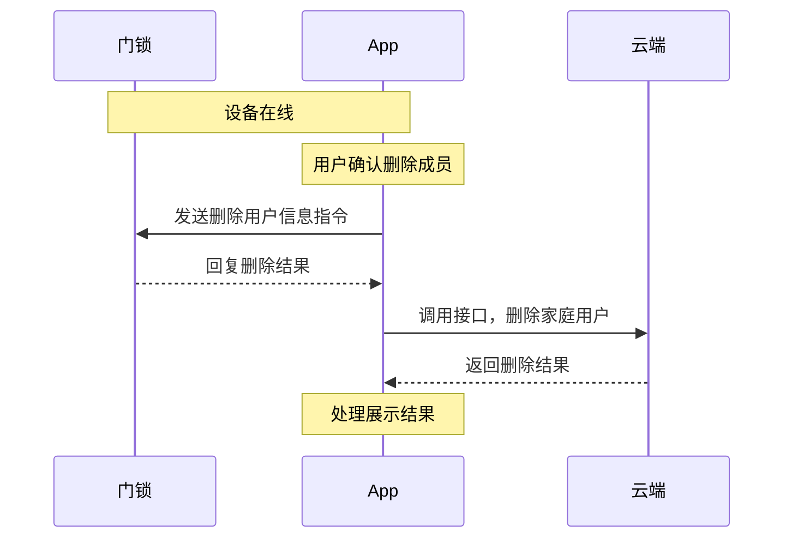
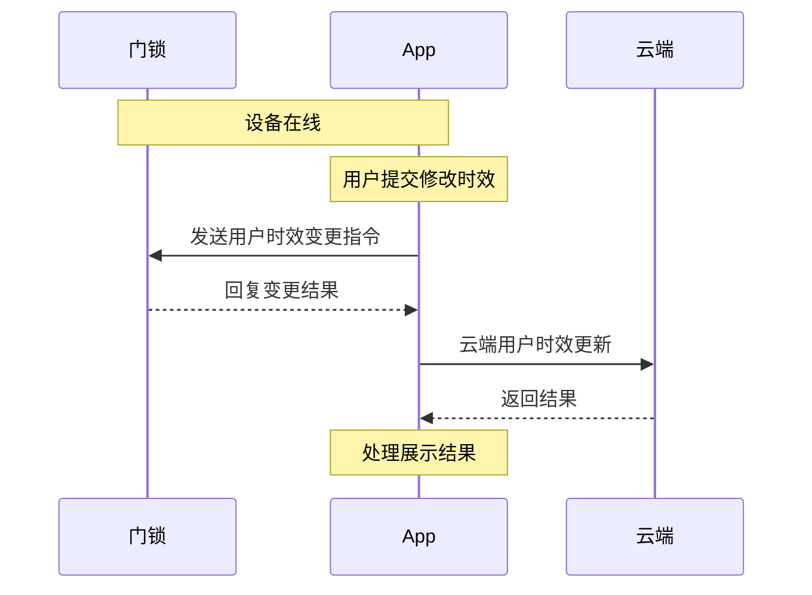
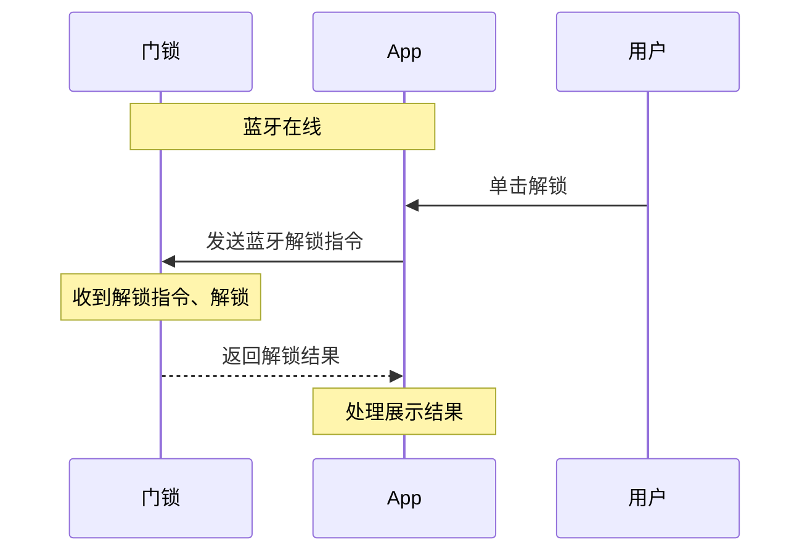
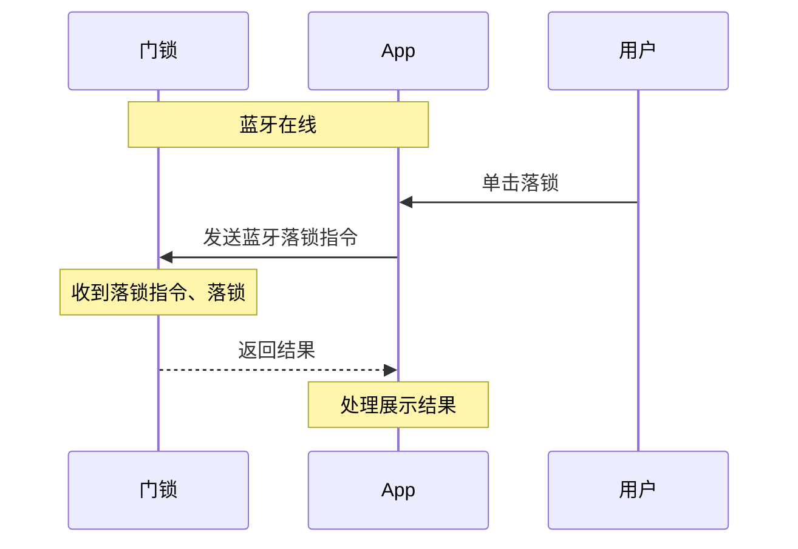
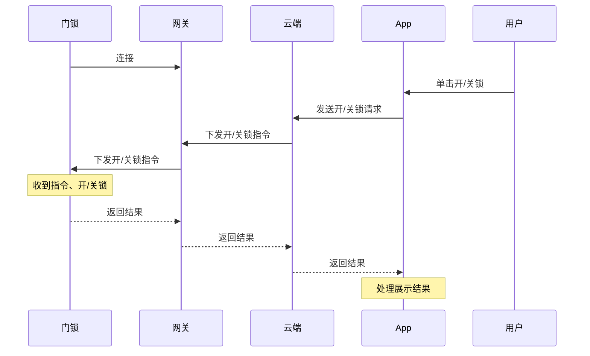
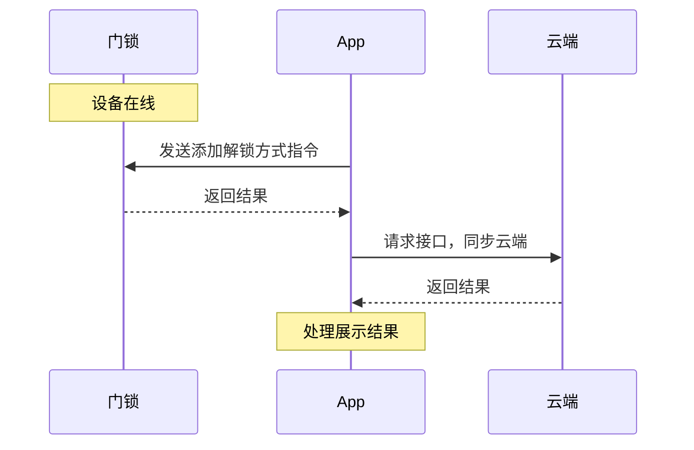
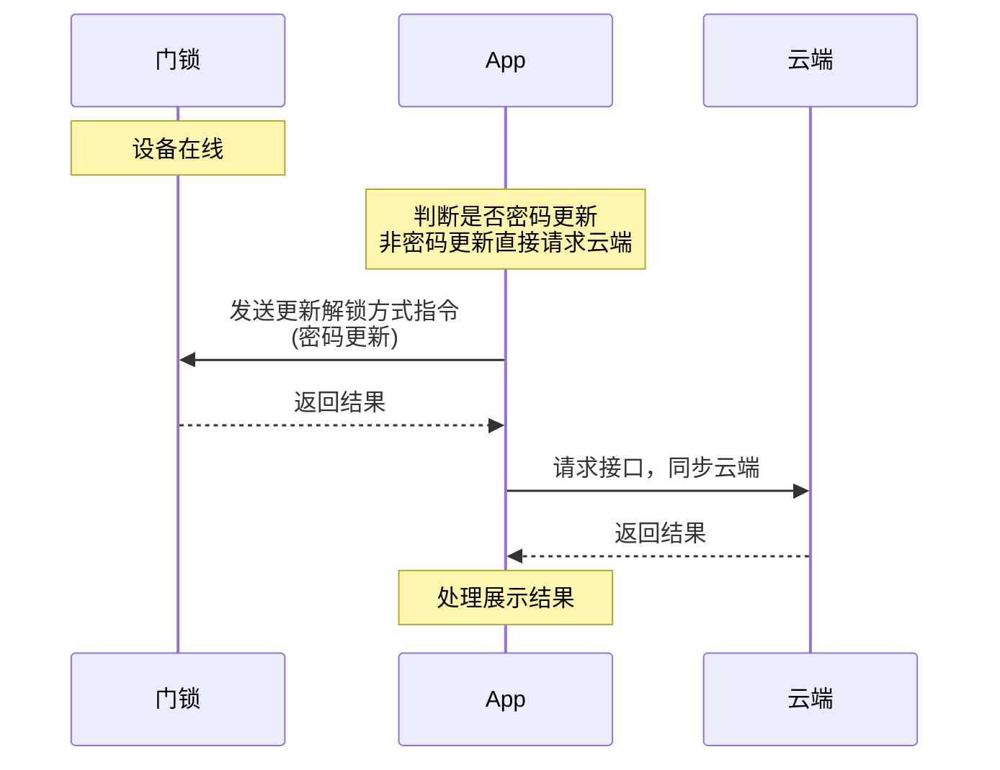
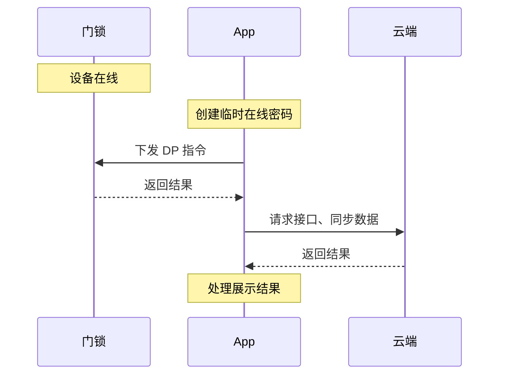
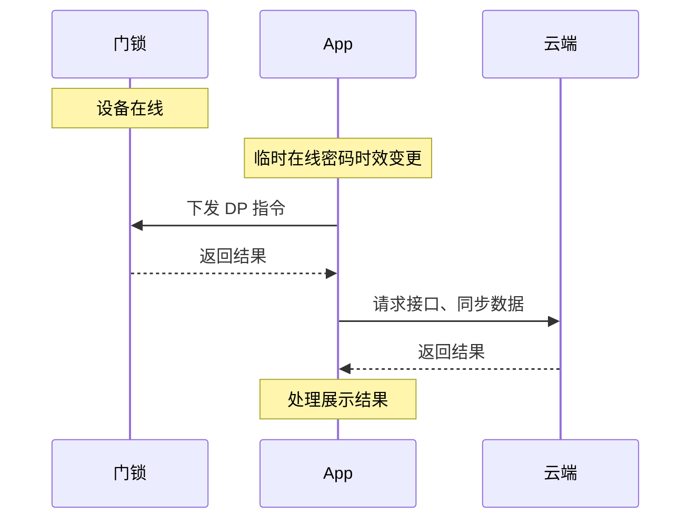
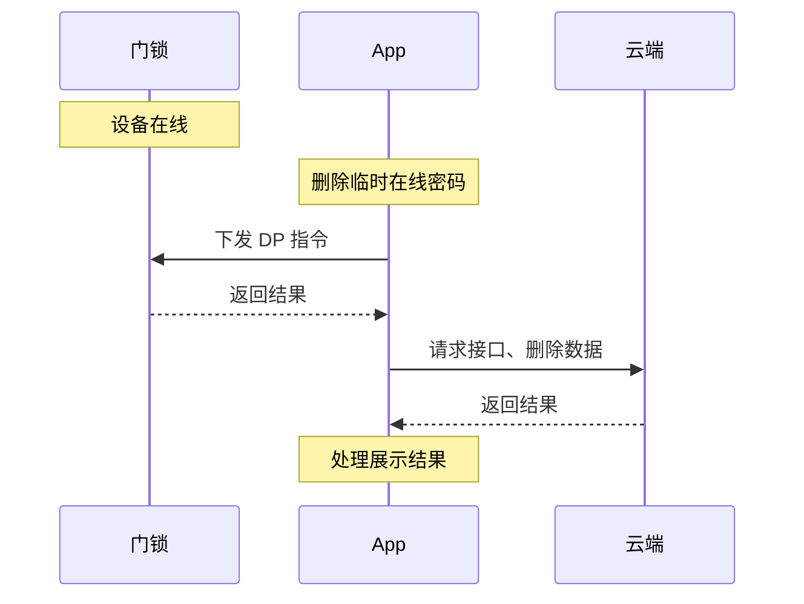

# 蓝牙门锁

[中文版](README_zh.md) | [English](README.md)

## 使用说明

| 类名 | 说明 |
| ---- | ---- |
| `ThingOptimusSdk` | 初始化门锁 SDK 入口，用来获取门锁管理类 |
| `IThingLockManager` | 门锁管理类，可以获取不同类型的门锁类 |
| `IThingBleLockV2` | 蓝牙门锁类，所有蓝牙门锁相关方法都包含在其中 |

**示例代码**

通过设备 ID 创建蓝牙门锁类。

```java
// 初始化门锁 SDK，仅需要调用一次
ThingOptimusSdk.init(getApplicationContext());
// 获取 IThingLockManager
IThingLockManager thingLockManager = ThingOptimusSdk.getManager(IThingLockManager.class);
// 创建 IThingBleLockV2
IThingBleLockV2 thingLockDevice = thingLockManager.getBleLockV2(your_device_id);
```

## 名词解释

| 名词 | 说明 |
| --- | --- |
| 门锁劫持 | 指将特定的指纹、密码等，设置为劫持密码，当用户被劫持，并使用该密码开锁时，门会打开。同时，门锁将开门报警信息发送至家人手机或物业管理系统。|
| 门锁成员 | 门锁成员为 **家庭成员**，等同于智能生活 App SDK 中的家庭成员概念。门锁 SDK 将对应的门锁密码编号与该成员关联起来。更多详情，请参考 [家庭管理](https://developer.tuya.com/cn/docs/app-development/homemanage?id=Ka6kjkgere4ae)。 |
| lockUserId | 创建 **门锁成员** 时，云端为设备分配的固件成员 ID，代表着固件内记录的用户 ID。|
| userId | 创建 **门锁成员** 时，云端分配的数据库记录 ID，代表着用户的唯一 ID。|
| dpCode | 设备功能的标识符。每个设备功能都有名称和编号，请参考下文 [门锁本地 DP 设置操作标准 DP](#dp)。|
| unlockId | 解锁方式编号，由解锁方式 DPID 加硬件锁 ID 组合而成。例如 `12-02`。 |

:::important
接入门锁 SDK 后，您需要执行 [同步数据](#data_synchronization)，相关解锁方式方可使用。
:::

## 门锁成员

本小节主要介绍门锁成员中 **家庭成员** 的管理操作。

<a id="lock_member_list"></a>

### 获取门锁成员列表

**接口说明**

```java
/**
* 获取家庭成员列表
*
* @param callback 回调
*/
void getProLockMemberList(IThingResultCallback<ArrayList<MemberInfoBean>> callback);
```

**`MemberInfoBean`** 数据模型

| 字段 | 类型 | 描述 |
| --- | --- | --- |
| userId | String | 用户 ID |
| avatarUrl | String | 头像 URL |
| lockUserId | Integer | 用户在锁固件里的 ID |
| nickName | String | 昵称 |
| userType | Integer | 用户类型<ul><li>10：管理员</li><li>20：普通成员</li><li>50：家庭拥有者</li></ul> |
| backHomeNotifyAttr | Integer | **家人到家提醒** 开关是否打开<ul><li>0：否</li><li>1：是</li></ul> |
| userContact | String | 用户联系方式 |
| offlineUnlock | Boolean | 是否支持离线解锁<ul><li>是：true</li><li>否：false</li></ul> |
| unlockDetail | List | 用户拥有的解锁方式列表，查看 `UnlockDetail` 数据模型 |
| timeScheduleInfo | TimeScheduleInfo | 用户时效 |

**`TimeScheduleInfo`** 数据模型

| 字段 | 类型 | 描述 |
| --- | --- | --- |
| permanent | Boolean | 是否永久用户 |
| timeSetShifted | Boolean | 管理员的时效是否偏移（非永久） |
| userTimeSet | String | 用户时效（16 进制） |
| effectiveTime | Integer | 生效时间（10 位） |
| expiredTime | Integer | 失效时间（10 位） |
| scheduleDetails | List | 是否周循环及生效区间，参考 [`ScheduleBean`](#mode_schedule_bean) 数据模型 |

<a id="mode_schedule_bean"></a>

**`ScheduleBean`** 数据模型

| 字段 | 类型 | 描述 |
| --- | --- | --- |
| workingDay | Integer | 工作日，参考值见修改成员时效 [特殊说明](#wording_day_illustrate) |
| allDay | Boolean | 是否全天 |
| effectiveTime | Integer | 生效分钟<br>例：当前早上 8 点整，值为 8 * 60 = 480 |
| invalidTime | Integer | 失效分钟<br>例：当前下午 8 点整，值为 20 * 60 = 1200 |
| timeZoneId | String | 时区信息 |

**`UnlockDetail`** 数据模型

| 字段 | 类型 | 描述 |
| --- | --- | --- |
| dpId | Integer | 设备功能 DP |
| count | Integer | 解锁方式个数 |
| unlockList | List | 解锁方式详情列表，参考 [`UnlockInfoBean`](#UnlockInfoBean) 数据模型 |

<a id="UnlockInfoBean"></a>

**`UnlockInfoBean`** 数据模型

| 字段 | 类型 | 描述 |
| --- | --- | --- |
| unlockId | String | 解锁方式编号 |
| opModeId | Long | 解锁方式云端序号 |
| unlockName | String | 解锁方式名称 |
| unlockAttr | Integer | 解锁方式属性<ul><li>1：门锁劫持</li><li>0：非门锁劫持</li></ul> |
| adminFlag | Boolean | 是否是管理员指纹 |
| photoUnlock | Boolean | 是否开启开门抓拍（仅拍照锁有此字段） |

**示例代码**

```java
thingLockDevice.getProLockMemberList(new IThingResultCallback<ArrayList<MemberInfoBean>>() {
    @Override
    public void onSuccess(ArrayList<MemberInfoBean> result) {
        Log.i(Constant.TAG, "getProLockMemberList success: lockUserBean = " + result);
    }

    @Override
    public void onError(String code, String message) {
        Log.e(Constant.TAG, "getProLockMemberList failed: code = " + code + " message = " + message);
    }
});
```

### 创建单个门锁成员

该接口创建的是家庭成员，添加的用户需要真实的 App 账号。

**接口说明**

```java
/**
* 添加家庭成员
*
* @param memberWrapperBean 入参
* @param callback          回调
*/
void createProLockMember(MemberWrapperBean memberWrapperBean,IThingDataCallback<MemberBean> callback);
```

**`MemberWrapperBean`** 数据模型

请参考 [家庭成员信息](https://developer.tuya.com/cn/docs/app-development/member-information-management?id=Kaiy91tma26nh)。

**示例代码**

```java
MemberWrapperBean.Builder memberWrapperBean = new MemberWrapperBean.Builder();
memberWrapperBean.setNickName();//成员昵称
memberWrapperBean.setCountryCode();//国家或地区编号
memberWrapperBean.setAccount();//App 账号
memberWrapperBean.setRole();//成员角色（请在家庭成员查看 MemberRole 定义类型）
memberWrapperBean.setHomeId();//当前设备所属家庭 ID
memberWrapperBean.setAutoAccept(false);//true 为受邀请账号自动接受家庭加入邀请
thingLockDevice.createProLockMember(memberWrapperBean.build(), new IThingDataCallback<MemberBean>() {
    @Override
    public void onSuccess(MemberBean result) {
        Log.i(Constant.TAG, "add lock user success");
    }

    @Override
    public void onError(String code, String message) {
        Log.e(Constant.TAG, "add lock user failed: code = " + code + " message = " + message);
    }
});
```

### 删除单个门锁成员

删除家庭用户成员、并删除设备上成员对应的所有解锁方式。



**接口说明**

```java
/**
* 删除成员
*
* @param memberInfoBean 成员信息
* @param callback       回调
*/
void removeProLockMember(MemberInfoBean memberInfoBean, IResultCallback callback);
```

**示例代码**

其中入参 `memberInfoBean` 为成员列表接口 `getProLockMemberList` 返回的数据模型。

```java
thingLockDevice.removeProLockMember(memberInfoBean, new IResultCallback() {
    @Override
    public void onError(String code, String error) {
        Log.e(Constant.TAG, "removeProLockMember failed: code = " + code + " message = " + error);
    }

    @Override
    public void onSuccess() {
        Log.i(Constant.TAG, "removeProLockMember success");
    }
});
```

### 修改单个成员信息

该接口只能修改成员昵称及成员角色。

**接口说明**

```java
/**
* 成员信息编辑
*
* @param memberWrapperBean 入参
* @param callback          回调
*/
void updateProLockMemberInfo(MemberWrapperBean memberWrapperBean, IResultCallback callback);
```

**`MemberWrapperBean`** 数据模型

请参考 [家庭成员信息](https://developer.tuya.com/cn/docs/app-development/member-information-management?id=Kaiy91tma26nh)。

**示例代码**

```java
MemberWrapperBean.Builder memberWrapperBean = new MemberWrapperBean.Builder();
memberWrapperBean.setNickName();//成员昵称
memberWrapperBean.setRole();//成员角色（请在家庭成员查看 MemberRole 定义类型）
memberWrapperBean.setMemberId();//成员列表返回的 userId
thingLockDevice.updateProLockMemberInfo(memberWrapperBean.build(), new IResultCallback() {
    @Override
    public void onError(String code, String error) {
        Log.e(Constant.TAG, "updateProLockMemberInfo failed: code = " + code + " message = " + error);
    }

    @Override
    public void onSuccess() {
        Log.i(Constant.TAG, "updateProLockMemberInfo success");
    }
});
```

### 修改单个成员时效（不支持低版本）

修改单个成员时效会和硬件进行交互，请保持门锁设备的蓝牙连接。



**接口说明**

其中入参 `memberInfoBean` 为成员列表接口 `getProLockMemberList` 返回的数据模型。

```java
/**
* 修改单个成员时效
*
* @param memberInfoBean 成员信息
* @param callback       回调
*/
void updateProLockMemberTime(MemberInfoBean memberInfoBean, IThingResultCallback<Boolean> callback);
```

**示例代码**

```java
thingLockDevice.updateProLockMemberTime(memberInfoBean, new IThingResultCallback<Boolean>() {
    @Override
    public void onSuccess(Boolean result) {
        Log.i(Constant.TAG, "updateProLockMemberTime success");
    }

    @Override
    public void onError(String code, String message) {
        Log.e(Constant.TAG, "updateProLockMemberTime failed: code = " + code + " message = " + message);
    }
});
```

<a id="wording_day_illustrate"></a>

**特殊说明**

周循环的选择字段 `workingDay` 由七个 1 或 0 组成。其中 1 为开启、0 为关闭，排序示例如下。由二进制转换为十进制存储。

| 六 | 五 | 四 | 三 | 二 | 一 | 日 | 二进制表示 | 计算结果（十进制） |
| --- | --- | --- | --- | --- | --- | --- | --- | --- |
| 1 | 1 | 1 | 1 | 1 | 1 | 1 | 1111111 | 127 |
| 0 | 0 | 0 | 0 | 0 | 0 | 0 | 0000000 | 0 |
| 0 | 1 | 1 | 1 | 1 | 0 | 0 | 0111100 | 60 |

门锁 SDK 提供了一个简便的计算方法，其中 [`ScheduleBean`](#mode_schedule_bean) 参考上文数据模型。

```java
//选中添加
scheduleBean.dayOfWeeks.add(ScheduleBean.DayOfWeek.MONDAY);
//移除
scheduleBean.dayOfWeeks.remove(ScheduleBean.DayOfWeek.FRIDAY);
//解析展示数据
scheduleBean.dayOfWeeks = LockUtil.parseWorkingDay(scheduleBean.workingDay);
//封装已选择的列表
scheduleBean.workingDay = Integer.parseInt(LockUtil.convertWorkingDay(scheduleBean.dayOfWeeks);
```

### 获取当前用户信息

**接口说明**

```java
/**
* 获取当前用户信息
*
* @param callback 回调
*/
void getCurrentMemberDetail(IThingResultCallback<BLELockUser> callback);
/**
* 获取当前用户信息 PRO 版本
*
* @param callback 回调
*/
void getProCurrentMemberDetail(IThingResultCallback<BLELockUserV3> callback);
```

**示例代码**

```java
thingLockDevice.getCurrentMemberDetail(new IThingResultCallback<BLELockUser>() {
    @Override
    public void onSuccess(BLELockUser result) {
        Log.i(Constant.TAG, "getCurrentMemberDetail:" + result);
    }

    @Override
    public void onError(String code, String error) {
        Log.e(Constant.TAG, "getCurrentMemberDetail onError code:" + code + ", error:" + error);
    }
});
//PRO 版本
thingLockDevice.getProCurrentMemberDetail(new IThingResultCallback<BLELockUserV3>() {
    @Override
    public void onSuccess(BLELockUserV3 result) {
        Log.i(Constant.TAG, "getProCurrentMemberDetail:" + result);
    }

    @Override
    public void onError(String code, String error) {
        Log.e(Constant.TAG, "getCurrentMemberDetail onError code:" + code + ", error:" + error);
    }
});
```

## 蓝牙连接

蓝牙门锁需要 App 开启蓝牙后，部分功能才能正常使用。

### 查询蓝牙连接状态

门锁 SDK 在正常情况下会自动连接，通常使用以下方法进行门锁连接状态判断。

**接口说明**

```java
/**
* @return 查询蓝牙连接状态
*/
boolean isBLEConnected();
/**
* @return 是否在线
*/
boolean isOnline();
```

**示例代码**

```java
boolean isBLEConnected = thingLockDevice.isBLEConnected();
boolean isOnline = thingLockDevice.isOnline();
if (!isBLEConnected && isOnline) {
    device_state_view.setText("网关已连接");
} else if (isBLEConnected && isOnline) {
    device_state_view.setText("蓝牙已连接");
} else {
    device_state_view.setText("离线");
}
```

### 门锁蓝牙连接

如果查询结果显示门锁未连接蓝牙，调用此接口可以连接到门锁。

**接口说明**

执行连接有 30 秒的超时时间，超时会通过 `onError` 回调，该 `ConnectV2Listener` 只回调一次，该方法为 [`connectBleDevice`](https://developer.tuya.com/cn/docs/app-development/android-bluetooth-ble?id=Karv7r2ju4c21#title-15-%E8%BF%9E%E6%8E%A5%E7%A6%BB%E7%BA%BF%E8%AE%BE%E5%A4%87) 的二次封装。

```java
/**
* 触发蓝牙连接
*
* @param connectListener 回调
*/
void autoConnect(ConnectV2Listener connectListener);
```

**示例代码**

```java
thingLockDevice.autoConnect(new ConnectV2Listener() {
    @Override
    public void onStatusChanged(boolean online) {
        Log.e(Constant.TAG, "device online:" + online);
    }

    @Override
    public void onError(String code, String error) {
        Log.e(Constant.TAG, "autoConnect onError code:" + code + ", error:" + error);
    }
});
```

## 蓝牙解锁和落锁

### 蓝牙近程解锁



**接口说明**

解锁有 30 秒的超时时间，超时会通过 `onError` 回调，该 `IResultCallback` 只回调一次。

```java
/**
* 蓝牙开锁
*
* @param lockUserId 用户在锁固件里的 ID
* @param callback   回调
*/
void bleUnlock(String lockUserId, IResultCallback callback);
```

**示例代码**

```java
//获取当前成员锁 ID
thingLockDevice.getCurrentMemberDetail(new IThingResultCallback<BLELockUser>() {
    @Override
    public void onSuccess(BLELockUser result) {
        Log.i(Constant.TAG, "getCurrentMemberDetail:" +result);
        //执行解锁
        thingLockDevice.bleUnlock(result.lockUserId, new IResultCallback() {
            @Override
            public void onError(String code, String error) {
                Log.e(Constant.TAG, "bleUnlock onError code:" + code + ", error:" + error);
            }

            @Override
            public void onSuccess() {
                Log.i(Constant.TAG, "bleUnlock onSuccess");
            }
        });
    }

    @Override
    public void onError(String code, String error) {
        Log.e(Constant.TAG, "getCurrentMemberDetail onError code:" + code + ", error:" + error);
    }
});
```

### 蓝牙近程落锁



**接口说明**

蓝牙门锁与 App 连接后，可调用此接口落锁。

落锁有 30 秒的超时时间，超时会通过 `onError` 回调，该 `IResultCallback` 只回调一次。

```java
/**
* 蓝牙关锁
*
* @param callback 回调
*/
void bleManualLock(IResultCallback callback);
```

**示例代码**

```java
thingLockDevice.bleManualLock(new IResultCallback() {
    @Override
    public void onError(String code, String error) {
        Log.e(Constant.TAG, "bleManualLock onError code:" + code + ", error:" + error);
    }

    @Override
    public void onSuccess() {
        Log.i(Constant.TAG, "bleManualLock onSuccess");
    }
});
```

### 蓝牙远程开关锁

查询和开关设置请参考下文 [设置](#ble_device_setting) 相关接口。



**接口说明**

有 30 秒的超时时间，超时会通过 `onError` 回调，该 `IResultCallback` 只回调一次。

```java
/**
* 远程开关锁
*
* @param open     开/关
* @param callback 回调
*/
void remoteSwitchLock(boolean open, IResultCallback callback);
```

**示例代码**

```java
thingLockDevice.remoteSwitchLock(true/false, new IResultCallback() {
    @Override
    public void onError(String code, String error) {
        Log.e(Constant.TAG, "remoteSwitchLock onError code:" + code + ", error:" + error);
    }

    @Override
    public void onSuccess() {
        Log.i(Constant.TAG, "remoteSwitchLock onSuccess");
    }
});
```

## 门锁记录

### 获取门锁告警记录

该方法为旧公版方法，PRO 类型门锁建议使用 [带筛选的新版记录接口（日志组件）](#record_doc_new)。

**接口说明**

```java
/**
* get alarm records in old version
*
* @param offset   page number
* @param limit    item count
* @param callback callback
*/
void getAlarmRecordList(int offset, int limit, IThingResultCallback<Record> callback);
```

**参数说明**

| 参数 | 说明 |
| --- | --- |
| offset | 返回的记录页码数 |
| limit | 返回的记录条目数 |

**`Record`** 数据模型

| 字段 | 类型 | 描述 |
| --- | --- | --- |
| totalCount | Integer | 总条目 |
| hasNext | Boolean | 是否有下一页 |
| datas | List | 记录数据内容，参考 [`DataBean`](#DataBean1) |

**<ph id="DataBean1">`DataBean`</ph>** 数据模型

| 字段 | 类型 | 描述 |
| --- | --- | --- |
| userId | String | 成员 ID |
| userName | String | 用户昵称 |
| unlockType | String | 解锁类型 |
| devId | String | 设备 ID |
| createTime | Long | 该记录的时间戳 |
| tags | Integer | 标位<ul><li>0：表示其他</li><li>1：表示劫持报警</li></ul> |
| unlockRelation | UnlockRelation | 解锁类型和解锁密码编号的关系实例，如不是开锁记录，可为空 |

**示例代码**

```java
thingLockDevice.getAlarmRecordList(0, 10, new IThingResultCallback<Record>() {
    @Override
    public void onSuccess(Record result) {
        Log.i(Constant.TAG, "get alarm records success: recordBean = " + result);
    }

    @Override
    public void onError(String errorCode, String errorMessage) {
        Log.e(Constant.TAG, "get alarm records failed: code = " + errorCode + " message = " + errorMessage);
    }
});
```

### 获取门锁开锁记录

该方法为旧公版方法，PRO 类型门锁建议使用 [带筛选的新版记录接口（日志组件）](#record_doc_new)。

**接口说明**

相关参数参考告警记录。

```java
/**
* get unlock records in old version
*
* @param offset   page number
* @param limit    item count
* @param callback callback
*/
void getUnlockRecordList(int offset, int limit, IThingResultCallback<Record> callback);
```

**示例代码**

```java
thingLockDevice.getUnlockRecordList(0, 10, new IThingResultCallback<Record>() {
    @Override
    public void onSuccess(Record result) {
        Log.i(Constant.TAG, "getUnlockRecordList success: recordBean = " + result);
    }

    @Override
    public void onError(String errorCode, String errorMessage) {
        Log.e(Constant.TAG, "getUnlockRecordList failed: code = " + errorCode + " message = " + errorMessage);
    }
});
```

### 获取门锁劫持告警记录

该方法为旧公版方法，PRO 类型门锁建议使用 [带筛选的新版记录接口（日志组件）](#record_doc_new)。

**接口说明**

相关参数参考告警记录。

```java
/**
* get hijacking records in old version
*
* @param offset page number
* @param limit item count
* @param callback callback
*/
void getHijackRecords(int offset, int limit, IThingResultCallback<Record> callback);
```

**示例代码**

```java
thingLockDevice.getHijackRecords(0, 10, new IThingResultCallback<Record>() {
    @Override
    public void onSuccess(Record result) {
        Log.i(Constant.TAG, "getHijackRecords success: recordBean = " + result);
    }

    @Override
    public void onError(String errorCode, String errorMessage) {
        Log.e(Constant.TAG, "getHijackRecords failed: code = " + errorCode + " message = " + errorMessage);
    }
});
```

<a id="record_doc_new"></a>

### 带筛选的新版记录接口（日志组件）

新版本记录接口，适用于 PRO 类型的门锁。

**接口说明**

```java
/**
* PRO 记录列表
*
* @param request 入参
* @param callback 监听
*/
void getProUnlockRecordList(RecordRequest request, IThingResultCallback<ProRecord> callback);
```

**`RecordRequest`** 数据模型

| 字段 | 类型 | 描述 |
| --- | --- | --- |
| logCategories | String | 日志类型<ul><li>操作日志：operation</li><li>开门记录：unlock_record</li><li>关门记录：close_record</li><li>告警记录：alarm_record</li></ul>以逗号分隔，门锁 SDK 封装为枚举 List |
| userIds | String | 需要筛选的用户 ID 的列表，以逗号分隔，如 `12,13` |
| onlyShowMediaRecord | Boolean | 是否仅显示带图片或者视频的记录，默认为 `false` 显示所有记录 |
| startTime | Long | 开始时间（单位毫秒） |
| endTime | Long | 结束时间（单位毫秒） |
| lastRowKey | String | 上一页的数据 key（第一页为空） |
| limit | Integer | 每页数据个数 |

**`ProRecord`** 数据模型

| 字段 | 类型 | 描述 |
| --- | --- | --- |
| hasNext | Boolean | 是否有分页 |
| lastRowKey | String | 上一页的数据 Key |
| records | List | 记录列表，单个记录参考 [`DataBean`](#DataBean2) |

**<ph id="DataBean2">`DataBean`</ph>** 数据模型

| 字段 | 类型 | 是否必反回 | 描述 |
| --- | --- | --- | --- |
| logId | Long | 是 | 日志编号 |
| logCategory | String | 是 | 日志类型<ul><li>操作日志：operation</li><li>开门记录：unlock_record</li><li>关门记录：close_record</li><li>告警记录：alarm_record</li></ul> |
| logType | String | 是 | 日志类型，详情请参考 [附录](#appendix) |
| recordType | Integer | 否 | 仅开门记录返回<ol><li>普通开门记录 </li><li>告警记录</li></ol> |
| unlockNameRosettaKey | String | 否 | 关锁记录的类型，详情请参考 [附录](#appendix) |
| currentUser | Boolean | 否 | 是否是当前用户的记录，是为`true`，非组合解锁必反回 |
| userId | String | 否 | 用户编号(仅开门记录，劫持告警，操作记录返回) |
| userName | String | 否 | 用户名称 |
| memberBindableFlag | Boolean | 是 | 是否可以绑定到用户 |
| unlockName | String | 否 | 解锁方式名称，可能为空 |
| time | Long | 是 | 日志事件时间 |
| relateDevName | String | 否 | 关联设备名称 |
| relateOpMode | String | 否 | 关联解锁信息 |
| data | String | 是 | 操作记录，数据格式定义请参考 [附录](#appendix) |
| unionUnlockInfo | UnionUnlockInfo | 否 | 组合解锁信息 |
| mediaInfoList | List | 否 | 视频和图片信息（仅可视对讲、Wi-Fi 低功耗常保活带视频或者图像的锁有此字段），参考 [`MediaInfoBean`](#MediaInfoBean) |

**`UnionUnlockInfo`** 数据模型

| 字段 | 类型 | 是否必反回 | 描述 |
| --- | --- | --- | --- |
| userName | String | 否 | 组合解锁时，触发的用户名称(可能为空) |
| opMode | String | 否 | 组合解锁时，解锁方式类型 |
| unlockName | String | 否 | 组合解锁时，解锁方式的名称(可能为空) |
| currentUser | Boolean | 否 | 组合解锁时，是否是当前用户 |
| sn | Integer | 否 | 组合解锁时，硬件编号 |

**<ph id="MediaInfoBean">`MediaInfoBean`**</ph> 数据模型

| 字段 | 类型 | 是否必反回 | 描述 |
| --- | --- | --- | --- |
| fileUrl | String | 否 | 封面图文件 URL |
| fileKey | String | 否 | 封面图的解密密钥 |
| mediaPath | String | 否 | 记录视频的相对地址 |
| mediaBucket | String | 否 | 记录视频所属的仓库地址 |
| mediaKey | String | 否 | 记录视频的解密密钥 |

**示例代码**

```java
ArrayList<RecordRequest.LogRecord> logRecords = new ArrayList<>();
logRecords.add(RecordRequest.LogRecord.UNLOCK_RECORD);
logRecords.add(RecordRequest.LogRecord.CLOSE_RECORD);
logRecords.add(RecordRequest.LogRecord.ALARM_RECORD);
logRecords.add(RecordRequest.LogRecord.OPERATION);
RecordRequest request = new RecordRequest();
request.setLogCategories(logRecords);
request.setLimit(10);
thingLockDevice.getProUnlockRecordList(request, new IThingResultCallback<ProRecord>() {
    @Override
    public void onSuccess(ProRecord result) {
        Log.i(Constant.TAG, "get ProUnlock RecordList success: recordBean = " + result);
    }

    @Override
    public void onError(String errorCode, String errorMessage) {
        Log.e(Constant.TAG, "get ProUnlock RecordList failed: code = " + errorCode + " message = " + errorMessage);
    }
});
```

## 解锁方式

### 获取成员已绑定的解锁方式列表

**接口说明**

```java
/**
* 获取成员已绑定的解锁方式列表
*
* @param userId   用户 ID
* @param callback 回调
*/
void getProBoundUnlockOpModeList(String userId, IThingResultCallback<MemberInfoBean> callback);
```

**示例代码**

返回成员数据模型 `MemberInfoBean` 参考成员列表。

```java
thingLockDevice.getProBoundUnlockOpModeList(userId, new IThingResultCallback<MemberInfoBean>() {
    @Override
    public void onSuccess(MemberInfoBean result) {
        Log.i(Constant.TAG, "getProBoundUnlockOpModeList:" + result);
    }

    @Override
    public void onError(String code, String message) {
        Log.e(Constant.TAG, "getProBoundUnlockOpModeList failed: code = " + code + " message = " + message);
    }
});
```

### 判断是否有需要分配的开锁方式

**接口说明**

```java
/**
* 判断是否有需要分配的开锁方式
*
* @param callback 回调
*/
void isProNeedAllocUnlockOpMode(IThingResultCallback<Boolean> callback);
```

**示例代码**

```java
thingLockDevice.isProNeedAllocUnlockOpMode(new IThingResultCallback<Boolean>() {
    @Override
    public void onSuccess(Boolean result) {
        Log.i(Constant.TAG, "isProNeedAllocUnlockOpMode:" + result);
    }

    @Override
    public void onError(String code, String message) {
        Log.e(Constant.TAG, "isProNeedAllocUnlockOpMode failed: code = " + code + " message = " + message);
    }
});
```

### 获取成员未绑定的解锁方式列表

**接口说明**

```java
/**
* 获取成员未绑定的解锁方式列表
*
* @param callback 回调
*/
void getProUnboundUnlockOpModeList(IThingResultCallback<ArrayList<AllocOpModeBean>> callback);
```

**示例代码**

```java
thingLockDevice.getProUnboundUnlockOpModeList(new IThingResultCallback<ArrayList<AllocOpModeBean>>() {
    @Override
    public void onSuccess(ArrayList<AllocOpModeBean> result) {
        Log.i(Constant.TAG, "getProUnboundUnlockOpModeList:" + result);
    }

    @Override
    public void onError(String code, String message) {
        Log.e(Constant.TAG, "getProUnboundUnlockOpModeList failed: code = " + code + " message = " + message);
    }
});
```

**`AllocOpModeBean`** 数据模型

| 字段 | 类型 | 描述 |
| --- | --- | --- |
| opMode | String | 解锁方式<ul><li>1：指纹</li><li>2：密码</li><li>3：门卡</li></ul> |
| unlockList | List | 待分配的解锁方式详情，参考数据模型 [`UnlockInfoBean`](#UnlockInfoBean) |

### 开锁方式分配到人

**接口说明**

```java
/**
* 开锁方式分配到人
*
* @param userId    用户 ID
* @param unlockIds 解锁方式 DP
* @param callback 回调
*/
void allocProUnlockOpMode(String userId, List<String> unlockIds, IThingResultCallback<Boolean> callback);
```

**请求参数**

| 字段 | 类型 | 描述 |
| --- | --- | --- |
| userId | String | 用户 ID |
| unlockIds | List | 解锁方式列表 |

**示例代码**

```java
thingLockDevice.allocProUnlockOpMode(userId, unlockIds, new IThingResultCallback<Boolean>() {
    @Override
    public void onSuccess(Boolean result) {
        Log.i(Constant.TAG, "allocProUnlockOpMode onSuccess: " + result);
    }

    @Override
    public void onError(String code, String message) {
        Log.e(Constant.TAG, "allocProUnlockOpMode failed: code = " + code + " message = " + message);
    }
});
```

<a id="addMethod"></a>

### App 发起添加解锁方式



**接口说明**

```java
/**
* 旧公版-添加解锁方式
*
* @param opModeAddRequest 入参
* @param callback         回调
*/
void addUnlockOpModeForMember(OpModeRequest opModeAddRequest, IThingResultCallback<AddOpmodeResult> callback);
/**
* PRO 版本-添加解锁方式
*
* @param opModeAddRequest 入参
* @param callback         回调
*/
void addProUnlockOpModeForMember(OpModeRequest opModeAddRequest, IThingResultCallback<AddOpmodeResult> callback);
```

**`OpModeRequest`** 数据模型

| 字段 | 类型 | 描述 |
| --- | --- | --- |
| userId | String | 用户 ID |
| unlockId | String | 解锁方式编号，取值为 `<dp>-<硬件锁 ID>` 格式，例如 `1-01` |
| unlockName | String | 解锁方式名称（可以为空，低版本必填） |
| opModeId | Long | 解锁方式云端序号（更新时使用） |
| unlockAttr | Integer | 是否开启特殊解锁通知（劫持）<ul><li>0：否</li><li>1：是</li></ul> |
| password | String | 密码类型密码 |
| notifyInfo | NotifyInfoBean | 通知信息（PRO 专用） |
| times | Integer | 次数 `0-255` |
| lockUserId | Integer | 用户在门锁固件上的 ID |
| unlockType | String | 解锁方式类型 `dpCode` |
| userType | Integer | 用户类型<ul><li>10：管理员</li><li>20：普通成员</li><li>50：家庭拥有者</li></ul> |

**`NotifyInfoBean`** 数据模型

| 字段 | 类型 | 描述 |
| --- | --- | --- |
| appSend | Boolean | 是否发送 App 消息（PRO 专用） |

**示例代码**

低版本与 PRO 版本的区别是新版本增加一些功能支持，接口版本不一致。

```java
OpModeRequest request = new OpModeRequest()
request.setUserType();//用户类型
request.setUserId();//用户 ID
request.setLockUserId();//用户在锁固件里的 ID
request.setUnlockName();//解锁方式名称
request.setUnlockAttr(0);//是否特殊（旧公版叫劫持）
request.setPassword();//密码类型解锁方式需要输入
//低版本示例
thingLockDevice.addUnlockOpModeForMember(request, new IThingResultCallback<AddOpmodeResult>() {
    @Override
    public void onSuccess(AddOpmodeResult result) {
        Log.i(Constant.TAG, "addUnlockOpModeForMember onSuccess");
    }

    @Override
    public void onError(String code, String message) {
        Log.e(Constant.TAG, "addUnlockOpModeForMember onError:" + code + ", message: " + message);
    }
});
//PRO 版本示例
thingLockDevice.addProUnlockOpModeForMember(request, new IThingResultCallback<AddOpmodeResult>() {
    @Override
    public void onSuccess(AddOpmodeResult result) {
        Log.i(Constant.TAG, "addProUnlockOpModeForMember onSuccess");
    }

    @Override
    public void onError(String code, String message) {
        Log.e(Constant.TAG, "addProUnlockOpModeForMember onError:" + code + ", message: " + message);
    }
});
```

**`AddOpmodeResult`** 数据模型

| 字段 | 类型 | 描述 |
| --- | --- | --- |
| opModeId | Long | 解锁方式云端序号（更新时使用） |
| unlockName | String | 解锁方式名称（可以为空） |

### App 发起删除解锁方式


**接口说明**

```java
/**
* 低版本 删除解锁方式
*
* @param unlockMode 入参
* @param callback   回调
*/
void removeUnlockOpModeForMember(OpModeRemoveRequest unlockMode, IThingResultCallback<Boolean> callback);
/**
* PRO 删除解锁方式
*
* @param unlockMode 入参
* @param callback   回调
*/
void removeProUnlockOpModeForMember(OpModeRemoveRequest unlockMode, IThingResultCallback<Boolean> callback);
```

**`OpModeRemoveRequest`** 数据模型

| 字段 | 类型 | 描述 |
| --- | --- | --- |
| userId | String | 用户 ID |
| lockUserId | String | 用户在锁固件里的 ID |
| userType | Integer | 用户类型 |
| unlockId | String | 解锁方式编号 |
| opModeId | String | 解锁方式云端编号 |

**示例代码**

```java
OpModeRemoveRequest removeRequest = new OpModeRemoveRequest();
removeRequest.setUserId(memberInfo.getUserId());
removeRequest.setLockUserId(memberInfo.getLockUserId());
removeRequest.setUnlockId(infoBean.getUnlockId());
removeRequest.setOpModeId(infoBean.getOpModeId());
removeRequest.setUserType(memberInfo.getUserType());
//低版本
thingLockDevice.removeUnlockOpModeForMember(removeRequest, new IThingResultCallback<Boolean>() {
    @Override
    public void onSuccess(Boolean result) {
        Log.i(Constant.TAG, "removeUnlockOpModeForMember onSuccess");
    }

    @Override
    public void onError(String errorCode, String errorMessage) {
        Log.e(Constant.TAG, "removeUnlockOpModeForMember onError:" + code + ", message: " + message);
    }
});
//PRO 版本
thingLockDevice.removeProUnlockOpModeForMember(removeRequest, new IThingResultCallback<Boolean>() {
    @Override
    public void onSuccess(Boolean result) {
        Log.i(Constant.TAG, "removeProUnlockOpModeForMember onSuccess");
    }

    @Override
    public void onError(String code, String message) {
        Log.e(Constant.TAG, "removeProUnlockOpModeForMember onError:" + code + ", message: " + message);
    }
});
```

<a id="update_unlock_type"></a>

### App 发起更新解锁方式



**接口说明**

`OpModeRequest` 入参数据模型参考 [添加解锁方式](#addMethod)。

```java
/**
* 更新解锁方式
*
* @param opModeUpdateRequest 入参
* @param callback            回调
*/
void modifyUnlockOpModeForMember(OpModeRequest opModeUpdateRequest, IThingResultCallback<Boolean> callback);
/**
* PRO 更新解锁方式
*
* @param opModeUpdateRequest 入参
* @param callback            回调
*/
void modifyProUnlockOpModeForMember(OpModeRequest opModeUpdateRequest, IThingResultCallback<Boolean> callback);
```

**示例代码**

```java
NotifyInfoBean notifyInfoBean = new NotifyInfoBean();
notifyInfoBean.setAppSend(true);
OpModeRequest request = new OpModeRequest();
request.setUserType();//用户类型
request.setUserId();  //用户 ID
request.setLockUserId();//用户在锁固件里的 ID
request.setUnlockName();//解锁方式名称
request.setUnlockAttr(0);//是否特殊
request.setPassword();  //密码类型解锁方式需要输入
request.setOpModeId();  //云端锁 ID
request.setUnlockId();  //解锁方式编号
//低版本
thingLockDevice.modifyUnlockOpModeForMember(request, new IThingResultCallback<Boolean>() {
    @Override
    public void onSuccess(Boolean result) {
        Log.i(Constant.TAG, "modifyUnlockOpModeForMember onSuccess");
    }

    @Override
    public void onError(String code, String message) {
        Log.e(Constant.TAG, "modifyUnlockOpModeForMember onError:" + code + ", message: " + message);
    }
});
//PRO 更新
request.setNotifyInfo(notifyInfoBean);//通知方式开关设置
thingLockDevice.modifyProUnlockOpModeForMember(request, new IThingResultCallback<Boolean>() {
    @Override
    public void onSuccess(Boolean result) {
        Log.i(Constant.TAG, "modifyProUnlockOpModeForMember onSuccess");
    }

    @Override
    public void onError(String code, String message) {
        Log.e(Constant.TAG, "modifyProUnlockOpModeForMember onError:" + code + ", message: " + message);
    }
});
```

### App 发起取消录入指纹解锁方式

该方法在录入指纹解锁方式中使用。

**接口说明**

```java
/**
* 取消录入指纹解锁方式
*
* @param lockUserId 用户在锁固件里的 ID
* @param userType   成员类型
* @param callback   回调
*/
void cancelUnlockOpModeForFinger(int lockUserId, int userType, IResultCallback callback);
```

**示例代码**

取消成功后，会在添加解锁方式 `addUnlockOpModeForMember.onError` 上返回对应的 `code`，`code` 取值请参考 [附录](#appendix)。

```java
thingLockDevice.cancelUnlockOpModeForFinger(request.getLockUserId(), request.getUserType(), new IResultCallback() {
    @Override
    public void onError(String code, String message) {
         Log.e(Constant.TAG, "cancelUnlockOpModeForFinger onError:" + code + ", message: " + message);
    }

    @Override
    public void onSuccess() {
    }
});
```

### 查询单个解锁方式详情

适用于解锁方式详情查看或编辑使用。

**接口说明**

```java
/**
* 查询单个解锁方式详情
*
* @param opModeId 云端锁 ID
* @param callback 回调
*/
void getProUnlockOpModeDetail(long opModeId, IThingResultCallback<OpModeDetailBean> callback);
```

**请求参数**

| 字段 | 类型 | 描述 |
| --- | --- | --- |
| opModeId | Long | 云端锁 ID |

**`OpModeDetailBean`** 数据模型

| 字段 | 类型 | 描述 |
| --- | --- | --- |
| phase | Integer | 用户状态<ul><li>0：冻结</li><li>1：正常</li><li>5：已失效</li><li>6：未生效</li><li>7：已删除</li></ul> |
| unlockAttr | Integer | 解锁方式属性<ul><li> 1：特殊解锁方式</li><li>0：无</li></ul> |
| unlockName | String | 解锁方式名称 |
| userId | String | 用户编号 |
| opModeValue | String | 解锁方式值（16 进制） |
| opMode | String | 解锁方式类型，对应 DPID |
| unlockId | String | 解锁方式编号 |
| lockUserId | Integer | 用户在锁固件里的 ID |
| opModeId | Long | 解锁方式云端序号 |
| userTimeSet | String | 用户时效 |
| userType | Integer | 用户类型 |
| sourceAttribute | Integer | 开锁方式来源类型<ul><li>1：App 录入</li><li>2：门锁离线录入</li><li>3：门锁超级管理员录入指纹</li></ul> |
| notifyInfo | NotifyInfoBean | 通知设置，只有当解锁方式属性为 1 时返回（PRO 版本） |

**示例代码**

```java
thingLockDevice.getProUnlockOpModeDetail(opModeId, new IThingResultCallback<OpModeDetailBean>() {
    @Override
    public void onSuccess(OpModeDetailBean result) {
        Log.i(Constant.TAG, "getUnlockOpModeDetail: " + result);
    }

    @Override
    public void onError(String code, String message) {
        Log.e(Constant.TAG, "getUnlockOpModeDetail onError:" + code + ", message: " + message);
    }
});
```

### 设置或取消挟持解锁方式

解锁方式添加和更新接口已经内置该功能，您可以参考本小节描述了解具体使用方式。

**接口说明**

```java
/**
* 添加劫持标记
*
* @param dpId     DP
* @param unlockId 解锁方式编号（dpId + 硬件锁 ID）
* @param callback 回调
*/
void addHijackingConfig(String dpId, String unlockId, IThingResultCallback<Boolean> callback);

/**
* 移除劫持标记
*
* @param dpId     DP
* @param unlockId 解锁方式编号（dpId + 硬件锁 ID）
* @param callback 回调
*/
void removeHijackingConfig(String dpId, String unlockId, IThingResultCallback<Boolean> callback);
```

### 开启或关闭解锁方式通知

请参考 [App 发起更新解锁方式](#update_unlock_type) 相关接口。

## 密码管理

### 创建离线密码（单次、多次、清空）

**接口说明**

```java
/**
* 获取离线密码
*
* @param pwdType    密码类型
* @param gmtStart   开始时间
* @param gmtExpired 结束时间
* @param pwdName    密码名称
* @param callback   回调
*/
void getOfflinePassword(OfflineTempPasswordType pwdType, long gmtStart, long gmtExpired,
                    String pwdName,
                    IThingResultCallback<OfflineTempPassword> callback);

/**
* PRO 获取离线密码
*
* @param pwdType    密码类型
* @param gmtStart   开始时间
* @param gmtExpired 结束时间
* @param pwdName    密码名称
* @param callback   回调
*/
void getProOfflinePassword(OfflineTempPasswordType pwdType, long gmtStart, long gmtExpired,
                        String pwdName,
                        IThingResultCallback<OfflineTempPassword> callback);
```

**请求参数**

| 字段 | 类型 | 描述 |
| --- | --- | --- |
| pwdType | OfflineTempPasswordType | 枚举密码类型<ul><li>0：多次或不限次数密码</li><li>1：一次性密码</li><li>9：清空码</li></ul> |
| gmtStart | Long | 开始时间（非多次密码传 0） |
| gmtExpired | Long | 结束时间（非多次密码传 0） |
| pwdName | String | 密码名称 |

**示例代码**

```java
//低版本
thingLockDevice.getOfflinePassword(pwdType, gmtStart, gmtExpired, name, new IThingResultCallback<OfflineTempPassword>() {
    @Override
    public void onSuccess(OfflineTempPassword result) {
        Log.i(Constant.TAG, "getOfflinePassword success :" + result);
    }

    @Override
    public void onError(String code, String message) {
        Log.e(Constant.TAG, "getOfflinePassword failed: code = " + code + " message = " + message);
    }
});
//PRO 版本
thingLockDevice.getProOfflinePassword(pwdType, gmtStart, gmtExpired, name, new IThingResultCallback<OfflineTempPassword>() {
    @Override
    public void onSuccess(OfflineTempPassword result) {
        Log.i(Constant.TAG, "getProOfflinePassword success :" + result);
    }

    @Override
    public void onError(String errorCode, String errorMessage) {
        Log.e(Constant.TAG, "getProOfflinePassword failed: code = " + code + " message = " + message);
    }
});
```

**`OfflineTempPassword`** 数据模型

| 字段 | 类型 | 描述 |
| --- | --- | --- |
| unlockBindingId | String | 解锁方式授权编号（PRO 版本特有） |
| pwd | String | 生成的临时密码 |
| pwdId | String | 密码 ID |
| pwdName | String | 密码名称（PRO 版本特有） |
| gmtStart | Long | 生效时间（秒、10 位） |
| gmtExpired | Long | 失效时间（秒、10 位） |

### 获取单个离线密码的清空码

**接口说明**

```java
/**
* 获取某个离线密码的清空码
*
* @param revokeRequest 入参
* @param callback      回调
*/
void getSingleRevokeOfflinePassword(OfflinePasswordRevokeRequest revokeRequest, IThingResultCallback<String> callback);
```

**`OfflinePasswordRevokeRequest`** 数据模型

| 字段 | 类型 | 描述 |
| --- | --- | --- |
| passwordId | String | 离线密码的编号<ul><li>PRO 版本使用 `unlockBindingId`</li><li>低版本使用 `pwdId`</li></ul> |
| name | String | 离线清除单个的密码名称（PRO 版本特有） |

### 获取生效中可以被清空的离线不限次数密码

**接口说明**

```java
/**
*
* @param callback callback
*/
void getSingleRevokePasswordList(IThingResultCallback<ArrayList<OfflineTempPassword>> callback);
```

**示例代码**

```java
thingLockDevice.getSingleRevokePasswordList(new IThingResultCallback<ArrayList<OfflineTempPassword>>() {
    @Override
    public void onSuccess(ArrayList<OfflineTempPassword> result) {
        Log.i(Constant.TAG, "getSingleRevokePasswordList success: " + result);
    }

    @Override
    public void onError(String errorCode, String errorMessage) {
        Log.e(Constant.TAG, "getSingleRevokePasswordList failed: code = " + errorCode + " message = " + errorMessage);
    }
});
```

**示例代码**

```java
OfflinePasswordRevokeRequest revokeRequest = new OfflinePasswordRevokeRequest();
revokeRequest.setPasswordId();
revokeRequest.setName();//PRO 版本专有
thingLockDevice.getSingleRevokeOfflinePassword(revokeRequest, new IThingResultCallback<String>() {
    @Override
    public void onSuccess(String result) {
        Log.i(Constant.TAG, "getSingleRevokeOfflinePassword success :" + result);
    }

    @Override
    public void onError(String code, String message) {
        Log.e(Constant.TAG, "getSingleRevokeOfflinePassword failed: code = " + code + " message = " + message);
    }
});
```

### 临时在线密码重复校验

添加或更新临时在线密码已经内置该逻辑，您可以参考本小节描述了解具体使用方式。

**接口说明**

```java
/**
* 在线密码内容有效性校验
*
* @param request 入参
* @param callback 回调
*/
void validateCustomPassword(PasswordRequest request, IThingResultCallback<Boolean> callback);
```

**<ph id="PasswordRequest">`PasswordRequest`</ph>** 数据模型

| 字段 | 类型 | 描述 |
| --- | --- | --- |
| id | String | 密码 ID，PRO 版本使用 `unlockBindingId` 作为入参 |
| password | String | 临时密码 |
| sn | Integer | 设备密码序号（创建的时候设备上报） |
| effectiveTime | Long | 生效时间 |
| invalidTime | Long | 失效时间 |
| availTime | Integer | 可用次数<ul><li>0：永久</li><li>1：一次性（PRO 版本无此选项）</li></ul> |
| name | String | 密码名称 |
| schedule | ScheduleBean | 参考下文 [`ScheduleBean`](#mode_schedule_bean) |

**示例代码**

```java
thingLockDevice.validateCustomPassword(PasswordRequest, new IThingResultCallback<Boolean>() {
    @Override
    public void onSuccess(Boolean result) {
        Log.i(Constant.TAG, "validateCustomPassword success :" + result);
    }

    @Override
    public void onError(String code, String message) {
        Log.e(Constant.TAG, "validateCustomPassword failed: code = " + code + " message = " + message);
    }
});
```

### 创建临时在线密码

临时在线密码可以是一次性或周期性的。特别说明，PRO 版本门锁无临时在线一次性的选择。



**接口说明**

[`PasswordRequest`](#PasswordRequest) 数据模型请参考上文。

```java
/**
* 创建在线密码（包含一次性、周期性密码）
* PRO 版本 自定义密码（无一次性）
*
* @param request 入参
* @param callback 回调
*/
void getCustomOnlinePassword(PasswordRequest request, IThingResultCallback<String> callback);
```

**示例代码**

```java
thingLockDevice.getCustomOnlinePassword(PasswordRequest, new IThingResultCallback<String>() {
    @Override
    public void onSuccess(String result) {
        Log.i(Constant.TAG, "getCustomOnlinePassword success :" + result);
    }

    @Override
    public void onError(String errorCode, String errorMessage) {
        Log.e(Constant.TAG, "getCustomOnlinePassword failed: code = " + code + " message = " + message);
    }
});
```

### 修改临时在线密码的信息或时效



**接口说明**

```java
/**
* 修改临时在线密码的信息/时效
*
* @param request 入参
* @param callback 监听
*/
void updateOnlinePassword(PasswordRequest request, IThingResultCallback<String> callback);
```

**示例代码**

```java
thingLockDevice.updateOnlinePassword(passwordRequest, new IThingResultCallback<String>() {
    @Override
    public void onSuccess(String result) {
        Log.i(Constant.TAG, "updateOnlinePassword success :" + result);
    }

    @Override
    public void onError(String code, String message) {
        Log.e(Constant.TAG, "updateOnlinePassword failed: code = " + code + " message = " + message);
    }
});
```

### 删除临时在线密码



**接口说明**

```java
/**
* 删除临时在线密码(删除记录，界面将不显示)
*
* @param deleteRequest      入参
* @param callback           回调
*/
void deleteOnlinePassword(OnlinePasswordDeleteRequest deleteRequest, IThingResultCallback<String> callback);
```

**`OnlinePasswordDeleteRequest`** 数据模型

| 字段 | 类型 | 描述 |
| --- | --- | --- |
| passwordId | String | 离线密码的编号<ul><li> PRO 版本使用 `unlockBindingId` 作为入参</li><li>低版本使用 `pwdId` 或 ID 作为入参 </li></ul>|
| sn | Integer | 设备密码序号 |

**示例代码**

```java
OnlinePasswordDeleteRequest deleteRequest = new OnlinePasswordDeleteRequest();
deleteRequest.setSn(passwordItem.getSn());
deleteRequest.setPasswordId(passwordItem.getUnlockBindingId());
thingLockDevice.deleteOnlinePassword(deleteRequest, new IThingResultCallback<String>() {
    @Override
    public void onSuccess(String result) {
        Log.i(Constant.TAG, "deleteProOnlineTempPassword success: " + result);
    }

    @Override
    public void onError(String code, String message) {
        Log.e(Constant.TAG, "deleteProOnlineTempPassword failed: code = " + code + " message = " + message);
    }
});
```

### 获取离线密码列表（低版本）

PRO 版本门锁需要使用新版 [列表](#get_password_list)。

**接口说明**

```java
/**
* 旧公版 获取离线密码列表
*
* @param offlineType           密码类型：一次性、周期性、全部清空
* @param offset                起始记录数
* @param limit                 分页大小
* @param offlinePasswordStatus 密码状态：有效果、无效、使用过
* @param callback              监听
*/
void getOfflinePasswordList(OfflineTempPasswordType offlineType, int offset, int limit,
                        OfflineTempPasswordStatus offlinePasswordStatus,
                        IThingResultCallback<ArrayList<OfflineTempPasswordItem>> callback);
```

**请求参数**

| 字段 | 类型 | 描述 |
| --- | --- | --- |
| offlineType | OfflineTempPasswordType | 密码类型<ul><li>MULTIPLE：多次或不限次数密码</li><li>SINGLE：一次性密码</li><li>CLEAR_ALL：清空码</li></ul> |
| offset | Integer | 起始记录数 |
| limit | Integer | 分页大小 |
| offlinePasswordStatus | OfflineTempPasswordStatus | 密码状态<ul><li>TO_BE_USED：有效</li><li>USED：已使用</li><li>EXPIRED：无效</li></ul> |

**示例代码**

```java
thingLockDevice.getOfflinePasswordList(OfflineTempPasswordType.MULTIPLE, 0, 10, OfflineTempPasswordStatus.TO_BE_USED, new IThingResultCallback<ArrayList<OfflineTempPasswordItem>>() {
    @Override
    public void onSuccess(ArrayList<OfflineTempPasswordItem> result) {
        Log.i(Constant.TAG, "getOfflineTempPasswordList success: " + result);
    }

    @Override
    public void onError(String code, String message) {
        Log.e(Constant.TAG, "getOfflineTempPasswordList failed: code = " + code + " message = " + message);
    }
});
```

**`OfflineTempPasswordItem`** 数据模型

| 字段 | 类型 | 描述 |
| --- | --- | --- |
| pwdId | Integer | 密码编号 |
| pwdType | String | 密码类型 |
| pwdName | String | 密码名称 |
| gmtStart | Long | 生效时间 |
| gmtExpired | Long | 过期时间 |
| hasClearPwd | Boolean | 是否设置过清空码，仅当密码类型是 0（可以多次使用的密码）的时候返回 |
| revokedPwdName | String | 用于清除的密码名称，仅当密码类型是 8（单个密码的清除码）的时候返回 |
| status | Integer | 状态<ol><li>已下发，生效中</li><li>下发成功</li><li>已失效</li></ol> |

### 获取临时在线密码列表（低版本）

PRO 版本门锁需要使用新版 [列表](#get_password_list)。

**接口说明**

```java
/**
* 旧公版 在线密码列表
*
* @param availTimes 区分一次性密码或周期性密码，0 为周期性密码，1 为一次性密码
* @param callback   回调
*/
void getOnlinePasswordList(int availTimes, IThingResultCallback<ArrayList<TempPasswordBeanV3>> callback);
```

**请求参数**

| 字段 | 类型 | 描述 |
| --- | --- | --- |
| availTimes | Integer | <ul><li> 0 为周期性密码</li><li> 1 为一次性密码</li></ul> |

**示例代码**

```java
thingLockDevice.getOnlinePasswordList(availTimes, new IThingResultCallback<ArrayList<TempPasswordBeanV3>>() {
    @Override
    public void onSuccess(ArrayList<TempPasswordBeanV3> result) {
        Log.i(Constant.TAG, "getOnlinePasswordList success: " + result);
    }

    @Override
    public void onError(String code, String message) {
        Log.e(Constant.TAG, "getOnlinePasswordList failed: code = " + code + " message = " + message);
    }
});
```

**`TempPasswordBeanV3`** 数据模型

| 字段 | 类型 | 描述 |
| --- | --- | --- |
| id | Integer | 密码 ID |
| effective | Integer | 状态<ol><li>待生效</li><li>待下发</li><li>使用中</li><li>待删除</li><li>已过期</li></ol> |
| effectiveTime | Long | 生效时间 |
| invalidTime | Long | 失效时间 |
| availTime | Integer | 可用次数 <ul><li> 0 为永久可用</li><li> 1 为一次性密码</li></ul> |
| name | String | 密码名称 |
| sn | Integer | 密码在硬件编号 |
| scheduleDetails | ScheduleBean | 周重复失效，参考数据模型 [`ScheduleBean`](#mode_schedule_bean) |

<a id="get_password_list"></a>

### 获取密码列表

**接口说明**

```java
/**
* PRO 密码列表
* 授权类型
* 手机开门：LOCK_BLUE_PASSWORD
* 离线密码：LOCK_OFFLINE_TEMP_PWD
* 在线密码：LOCK_TEMP_PWD
*
* @param authTypes 授权类型
* @param callback 回调
*/
void getProPasswordList(List<ProPasswordListTypeEnum> authTypes, IThingResultCallback<ArrayList<ProTempPasswordItem>> callback);
```

**请求参数**

| 字段 | 类型 | 描述 |
| --- | --- | --- |
| authTypes | List | 枚举 `ProPasswordListTypeEnum`<ul><li>手机开门：LOCK_BLUE_PASSWORD</li><li>离线密码：LOCK_OFFLINE_TEMP_PWD</li><li>在线密码：LOCK_TEMP_PWD</li></ul> |

**示例代码**

```java
List<ProPasswordListTypeEnum> authTypes = new ArrayList<>();
authTypes.add(ProPasswordListTypeEnum.LOCK_BLUE_PASSWORD);
authTypes.add(ProPasswordListTypeEnum.LOCK_OFFLINE_TEMP_PWD);
authTypes.add(ProPasswordListTypeEnum.LOCK_TEMP_PWD);
thingLockDevice.getProPasswordList(authTypes, new IThingResultCallback<ArrayList<ProTempPasswordItem>>() {
    @Override
    public void onSuccess(ArrayList<ProTempPasswordItem> result) {
        Log.i(Constant.TAG, "getProPasswordList success: " + result);
    }

    @Override
    public void onError(String errorCode, String errorMessage) {
        Log.e(Constant.TAG, "getProPasswordList failed: code = " + errorCode + " message = " + errorMessage);
    }
});
```

**`ProTempPasswordItem`** 数据模型

| 字段 | 类型 | 描述 |
| --- | --- | --- |
| unlockBindingId | Long | 密码序列号 |
| effectiveTime | Long | 生效时间 |
| invalidTime | Long | 失效时间 |
| name | String | 名称 |
| userName | String | 关联用户名称（蓝牙开门分享一定存在，其他不一定） |
| scheduleDetails | List | 周循环详情，参考 [`ScheduleBean`](#mode_schedule_bean) |
| opModeType | Integer | 解锁方式类型<ol><li>带时效的临时密码</li><li>普通永久密码</li><li>离线临时密码</li><li>虚拟钥匙</li><li>指纹</li><li>门卡</li><li>手机蓝牙开门方式授权</li></ol> |
| opModeSubType | Integer | 参考下文 [opModeSubType](#opModeSubType) |
| sn | Integer | 硬件端编号 |
| lockUserId | Integer | 用户在锁固件里的 ID |
| account | String | 用户联系方式 |
| countryCode | String | 国家或地区编号 |
| timeSetType | Integer | 时效类型<ul><li>10. 永久</li><li>20. 起止</li><li>30. 循环</li></ul> |
| opModeInfo | OPModeInfo | 解锁方式独有的信息 |

<a id="opModeSubType"></a>

**`opModeSubType`** 解锁方式类型

| 类型 | 描述 |
| --- | --- |
| 离线临时密码 | <ul><li> 0. 可以多次使用</li><li>1. 单次使用</li><li>8. 清空单个</li><li>9. 清空全部</li></ul> |
| 在线临时密码 | <ul><li> 0. 时效密码</li><li>1. 只能使用一次的密码</li></ul> |
| 手机蓝牙开门方式授权 | <ul><li> 0. 时效内可以多次使用</li><li>1. 单次使用 </li></ul>|

**`OPModeInfo`** 数据模型

| 字段 | 类型 | 描述 |
| --- | --- | --- |
| hasClearPwd | Boolean | 是否设置清空码（离线密码必有） |
| revokedPwdName | String | 清空码名称 |
| revokedPwdEffectiveTime | String | 清空码有效时间 |
| revokedPwdInvalidTime | String | 清空码失效时间 |

### 创建动态密码

**接口说明**

```java
/**
* 获取动态密码
*
* @param callback 回调
*/
void getLockDynamicPassword(IThingResultCallback<DynamicPasswordBean> callback);
```

**`DynamicPasswordBean`** 数据模型

| 字段 | 类型 | 描述 |
| --- | --- | --- |
| dynamicPassword | String | 动态明文密码 |

**示例代码**

```java
thingLockDevice.getLockDynamicPassword(new IThingResultCallback<DynamicPasswordBean>() {
    @Override
    public void onSuccess(DynamicPasswordBean result) {
        Log.i(Constant.TAG, "getLockDynamicPassword onSuccess");
    }

    @Override
    public void onError(String code, String message) {
        Log.e(Constant.TAG, "getLockDynamicPassword onError:" + code + ", message: " + message);
    }
});
```

### 获取密码进制类型

通过面板云能力接口获取配置，云端返回的密码需要进行进制转换。

| 配置字段名 | 说明 | 默认值 |
| --- | --- | --- |
| digitalBase | 密码支持的进制 | `10` |
| isHideZero | 决定了最低位数为 `0` 或者 `1`<ul><li> true 表示从 `1` 开始</li><li>  false 从 `0` 开始 | `false` |

**接口说明**

```java
/**
* 获取密码进制类型
*
* @param callback 回调
*/
void getLockDeviceConfig(IThingResultCallback<String> callback);
```

**示例代码**

```java
thingLockDevice.getLockDeviceConfig(new IThingResultCallback<String>() {
    @Override
    public void onSuccess(String result) {
        Log.i(Constant.TAG, "getLockDeviceConfig success :" + result);
    }

    @Override
    public void onError(String errorCode, String errorMessage) {
        Log.e(Constant.TAG, "getLockDeviceConfig failed: code = " + errorCode + " message = " + errorMessage);
    }
});
```

<a id="ble_device_setting"></a>

## 门锁设置

### 查询远程开门开关

**接口说明**

```java
/**
* 查询是否开启远程开门开关
*
* @param callback 回调
*/
void fetchRemoteUnlockType(IThingResultCallback<Boolean> callback);
```

**示例代码**

```java
thingLockDevice.fetchRemoteUnlockType(new IThingResultCallback<Boolean>() {
    @Override
    public void onSuccess(Boolean result) {
        Log.i(Constant.TAG, "get remote unlock available success:" + result);
    }

    @Override
    public void onError(String code, String message) {
        Log.e(Constant.TAG, "get remote unlock available failed: code = " + code + " message = " + message);
    }
});
```

### 设置远程开门开关

**接口说明**

```java
/**
* 远程开门开关设置
*
* @param isOpen   开关配置
* @param callback 回调
*/
void setRemoteUnlockType(boolean isOpen, IResultCallback callback);
```

**示例代码**

```java
thingLockDevice.setRemoteUnlockType(isOpen, new IResultCallback() {
    @Override
    public void onError(String code, String error) {
        Log.e(Constant.TAG, "setRemoteUnlockType failed: code = " + code + " message = " + error);
    }

    @Override
    public void onSuccess() {
        Log.i(Constant.TAG, "setRemoteUnlockType success");
    }
});
```

### 查询谷歌语音密码开关

**接口说明**

```java
/**
* google 语音密码开启查询
*
* @param callback 回调
*/
void fetchRemoteVoiceUnlock(IThingResultCallback<Boolean> callback);
```

**示例代码**

```java
thingLockDevice.fetchRemoteVoiceUnlock(new IThingResultCallback<Boolean>() {
    @Override
    public void onSuccess(Boolean result) {
        Log.i(Constant.TAG, "fetchRemoteVoiceUnlock success:" + result);
    }

    @Override
    public void onError(String code, String message) {
        Log.e(Constant.TAG, "fetchRemoteVoiceUnlock failed: code = " + code + " message = " + message);
    }
});
```
### 设置谷歌语音密码

**接口说明**

```java
/**
* 设置或取消谷歌语音密码
*
* @param isOpen   开关设置
* @param password 语音密码
* @param callback 回调
*/
void setRemoteVoiceUnlock(boolean isOpen, String password, IThingResultCallback<Boolean> callback);
```

**示例代码**

```java
thingLockDevice.setRemoteVoiceUnlock(isOpen, password, new IThingResultCallback<Boolean>() {
    @Override
    public void onSuccess(Boolean result) {
        Log.i(Constant.TAG, "setRemoteVoiceUnlock success:" + result);
    }

    @Override
    public void onError(String code, String error) {
        Log.e(Constant.TAG, "setRemoteVoiceUnlock failed: code = " + code + " message = " + error);
    }
});
```

### 下发门锁设置 DP

<!-- （示例：延时落锁开关和时延） -->

使用 [设备控制](https://developer.tuya.com/cn/docs/app-development/andoird_device_control?id=Kaixh4pfm8f0y) 相关方法。

**示例代码**

该示例为开启延时落锁，并设置了 10 秒的时延。

```java
String automaticLock_dpId = LockUtil.convertCode2Id(deviceId, "automatic_lock");
String autoLockTime_dpId = LockUtil.convertCode2Id(deviceId, "auto_lock_time");
Map<String, Object> data = new HashMap<>();
dpMap.put(automaticLock_dpId, true);
dpMap.put(autoLockTime_dpId, 10);
IThingDevice iThingDevice = ThingHomeSdk.newDeviceInstance(mDevId);
iThingDevice.publishDps(dpMap, new IResultCallback() {
    @Override
    public void onError(String code, String error) {

    }

    @Override
    public void onSuccess() {

    }
});
```

<a id="data_synchronization"></a>

## 同步数据

### 同步门锁随机数/配件/记录

:::important
App
启动后，设备在线的时候执行一次。用于同步离线密码时间、门锁解锁随机数、获取门锁记录等。若未执行将无法解锁。
:::

**接口说明**

```java
void publishSyncBatchData();
```

**示例代码**

```java
thingLockDevice.publishSyncBatchData();
```

### 获取同步数据内容

该方法是获取 `publishSyncBatchData` 调用方法的云端数据内容，并未与设备交互。

**接口说明**

```java
void getSyncBatchData(IThingResultCallback<SyncBatchBean> callback);
```

**示例代码**

```java
thingLockDevice.getSyncBatchData(new IThingResultCallback<SyncBatchBean>() {
    @Override
    public void onSuccess(SyncBatchBean result) {

    }

    @Override
    public void onError(String code, String message) {
        Log.e(Constant.TAG, "getSyncBatchData failed: code = " + code + " message = " + message);
    }
});
```

### 同步解锁方式

添加解锁方式已内置该逻辑，您可以参考本小节描述了解具体使用方式。

**接口说明**

```java
/**
* 解锁方式同步
*
* @param dpIds    需要同步的解锁方式 DP
* @param callback 回调
*/
void syncData(List<String> dpIds, IResultCallback callback);
```

**示例代码**

```java
ArrayList<String> dpIds = new ArrayList<>();
dpIds.add(dpId);
thingLockDevice.syncData(dpIds, new IResultCallback() {
    @Override
    public void onError(String code, String error) {

    }

    @Override
    public void onSuccess() {

    }
});
```

<a id="appendix"></a>

## 附录

### 关锁记录类型

对返回的操作记录 `DataBean.unlockNameRosettaKey` 解析

| 类型 | 说明 |
| --- | --- |
| HISTORY_LOCK_UNDEFINED | 未定义的关锁类型 |
| HISTORY_LOCK_VOICE_REMOTE | 远程语音开门 |
| HISTORY_LOCK_APP_REMOTE | 远程手机开门 |
| HISTORY_LOCK_AUTO | 自动落锁关锁 |
| HISTORY_LOCK_LOCAL_MANUAL | 本地手动落锁 |
| HISTORY_LOCK_FITTINGS | 配件关锁 |
| HISTORY_LOCK_App | App 长按关锁 |
| HISTORY_LOCK_GEO_FENCE | 地理围栏关锁 |

### 操作记录数据格式

对返回的操作记录 `DataBean.data` 根据不同类型解析不同数据。

| 功能 | 数据定义 |
| --- | --- |
| 设备绑定 | `[<操作人名称>, <门锁名称>]` |
| 临时密码 | `[<临时密码名称>, <生效时间>, <失效时间>, <周期设置（支持多组-公版只有一组）[<是否全天有效>, <生效分钟>, <失效分钟>, <工作日>, <时区>]]` |
| 用户时效<br>（支持多组） | `[<"被修改时效的人",是否永久>, <生效时间>, <失效时间>, <周期设置（支持多组-公版只有一组）[是否全天有效>, <生效分钟>, <失效分钟>, <时区]>]`<br>如果非永久，则不包含 |
| 解锁方式新增或移除 | `[<被添加人的用户编号>, <被添加人的用户名称>, <硬件解锁方式名称>, <类型-门卡(标准 DP)>]` |
| 通信模组插拔事件 | `[<模组类型>]`，`1` 为低功耗蓝牙搭配 NB-IoT 模组 |
| 离线密码获取 | `[<离线密码名称,生效时间,失效时间,离线密码类型]>]`，离线密码类型：<ul><li>0. 多次密码</li><li>1. 单次密码</li><li>8. 清除单个</li><li>9. 清空所有已使用的</li></ul> |
| 离线密码名称修改 | `[<原始名称>, <修改后的名称>, <密码类型>]` |
| 解锁记录 | `"1"` 解锁方式 ID |

### 新版日志类型定义

| 类型 | 说明 |
| --- | --- |
| dev_bind | 设备绑定 |
| member_schedule_update | 成员时效修改 |
| unlock_add | 开锁方式增加 |
| unlock_del | 开锁方式删除 |
| temp_pwd_create | 临时密码增加 |
| temp_pwd_del | 临时密码删除 |
| temp_pwd_meta_update | 临时密码时效修改 |
| temp_pwd_name_update | 临时密码名称修改 |
| offline_pwd_achieve | 多次离线密码获取 |
| offline_pwd_clear_achieve | 清空所有离线密码获取 |
| offline_pwd_clear_single_achieve | 清空单个离线密码获取 |
| offline_pwd_name_update | 离线临时密码名称更新 |
| unlock_ble | 按键/蓝牙解锁 |
| unlock_password | 普通密码解锁 |
| unlock_temporary | 临时密码解锁 |
| unlock_dynamic | 动态密码解锁 |
| unlock_offline_pd | 离线密码解锁 |
| unlock_offline_clear | 离线密码清空所有上报 |
| unlock_offline_clear_single | 离线密码清空单个上报 |
| unlock_fingerprint | 指纹解锁 |
| unlock_card | 门卡解锁 |
| unlock_key | 机械钥匙解锁 |
| unlock_face | 人脸开锁 |
| unlock_eye | 虹膜解锁 |
| unlock_hand | 掌纹解锁 |
| unlock_finger_vein | 指静脉解锁 |
| unlock_double | 组合开锁（不带开门人） |
| unlock_double_kit | 组合开锁（带开门人） |
| alarm_lock | 告警 |
| hijack | 劫持 |
| lock_record | 关锁记录 |
| unlock_record_check | 配件记录 |
| unlock_phone_remote | 手机远程开门记录 |
| unlock_app | 旧版手机开门记录 |
| unlock_voice_remote | 音箱开门记录 |
| door_opened | 门被打开 |
| open_inside | 门从内侧打开 |
| timer_opened | 定时器开已执行 |
| timer_closed | 定时器关已执行 |
| dev_communication_module_add | 门锁插入或拔出模组 |

<a id="dp"></a>

### 门锁本地 DP 设置操作标准 DP

| 类型 | 说明 |
| --- | --- |
| arming_switch | 离家布防 |
| unlock_switch | 多重验证 |
| automatic_lock | 自动落锁 |
| auto_lock_time | 落锁延迟时间 |
| verify_lock_switch | 上锁校验开关 |
| do_not_disturb | 勿扰模式 |
| special_control | 特殊控制 |
| special_function | 特殊功能 |
| beep_volume | 导航音量 |

## 错误码

遵循 [门锁 SDK 基础错误码](https://developer.tuya.com/cn/docs/app-development/errorcode?id=Ka6o3bubtl735)。

| 错误码 | 说明 |
| --- | --- |
| 10203 | 设备不在线 |
| 10204 | 执行超时 |
| 13001 | 密码校验不通过 |
| 13002 | 数据校验失败 |
| 13003 | 数据不存在 |
| 13004 | DP 不存在 |
| 13005 | 指纹解锁方式指纹不完整 |
| 13006 | 设备上报添加开锁方式录入失败 |
| 13007 | 设备上报添加开锁方式 userId 不存在 |
| 13008 | 解锁方式增删改-门锁响应失败 |
| 13009 | 临时在线密码更新-设备上报失败 |
| 13010 | 临时在线密码删除-设备上报失败 |
| 13011 | 临时在线密码创建-设备上报失败 |
| 13012 | 临时在线密码创建-硬件 ID 分配完 |
| 130013 | 用户取消指纹录入 |


## Demo 示例

更多信息，参考 [tuya-home-android-sdk-sample-java](https://github.com/tuya/tuya-home-android-sdk-sample-java/tree/main/homesdk-sample/ble_lock)。